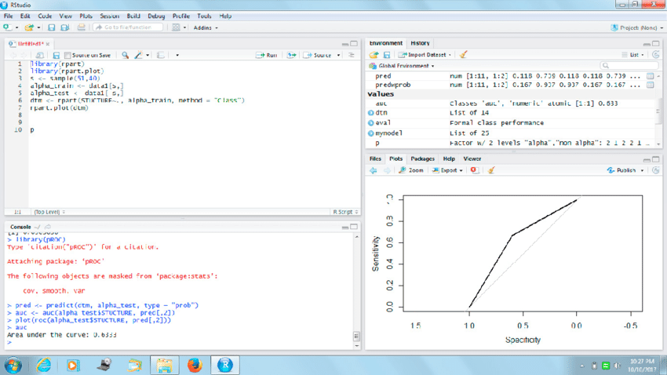

# cour 01 : **introduction à R :**

## 1. **Introduction:**

- **Introduction au langage R :**

>R est un langage de programmation et un environnement de développement dédié principalement à la **statistique** et à **l'analyse de données**. Il a été créé par Ross Ihaka et Robert Gentleman à l'Université d'Auckland, Nouvelle-Zélande. R est open-source et largement utilisé dans les domaines académiques, de la recherche et de l'industrie.

- Principales caractéristiques de R :

   - **Statistiques et Analyse de Données :** R propose une gamme étendue de fonctions statistiques et d'outils pour l'analyse de données.
   - **Graphiques et Visualisation :** La bibliothèque ggplot2 permet de créer des graphiques de haute qualité et personnalisables.
   - **Programmation Orientée Objet :** R supporte la programmation orientée objet avec des classes et des méthodes.


R est généralement considéré comme un langage interprété. Cela signifie que le code R est écrit et exécuté ligne par ligne ou par blocs, sans nécessiter une étape de compilation explicite avant l'exécution. L'interpréteur R évalue directement les instructions R et renvoie les résultats.


- **Introduction à RStudio :**

>RStudio est un environnement de développement intégré (IDE) spécialement conçu pour travailler avec le langage R. Créé par RStudio, Inc., cet IDE offre une interface utilisateur conviviale pour faciliter la programmation, la visualisation des données et la création de rapports interactifs.

- Caractéristiques de RStudio :
   - **Console R :** Une console interactive pour exécuter des commandes R.
   - **Script Editor :** Permet de créer, éditer et exécuter des scripts R.
   - **Environnement de travail :** Affiche les objets en mémoire, les fichiers, et offre un aperçu des packages installés.
   - **Visualisation des Plots :** Intègre une fenêtre pour afficher les graphiques et les visualisations.
   - **Support pour R Markdown :** Permet la création de documents dynamiques mêlant code, texte, et résultats.



RStudio simplifie le développement en R en fournissant des outils avancés tels que la coloration syntaxique, la complétion automatique, le débogage, et la gestion des packages. Il a contribué à rendre l'utilisation de R plus accessible aux utilisateurs de tous niveaux, qu'ils soient débutants ou experts.

## 2. **installer R sur Ubuntu :**

Pour installer R sur Ubuntu, vous pouvez suivre ces étapes simples en utilisant le terminal. Assurez-vous d'avoir les privilèges d'administrateur pour effectuer ces opérations.

1. **Mettre à jour votre liste de paquets :**
   ```bash
   sudo apt-get update
   ```

2. **Installer R :**
   ```bash
   sudo apt-get install r-base
   ```

   Cela installera le logiciel de base R. Si vous avez besoin d'environnements de développement et de bibliothèques supplémentaires, vous pouvez également installer `r-base-dev` :
   ```bash
   sudo apt-get install r-base-dev
   ```

3. **Vérifier l'installation :**
   Vous pouvez vérifier si R a été installé correctement en ouvrant le terminal et en tapant `R`. Cela devrait vous amener à l'invite R.

4. **Installer RStudio :**
   RStudio est un environnement de développement intégré (IDE) populaire pour R. Vous pouvez l'installer en téléchargeant le paquet correspondant depuis le site officiel de RStudio (https://www.rstudio.com/products/rstudio/download/) ou en utilisant les commandes suivantes dans le terminal :
   ```bash
   sudo apt-get install gdebi-core
   wget https://download1.rstudio.org/desktop/bionic/amd64/rstudio-1.4.1106-amd64.deb
   sudo gdebi rstudio-1.4.1106-amd64.deb
   ```

   Assurez-vous de remplacer le lien de téléchargement par la version la plus récente disponible sur le site de RStudio.

Ces étapes devraient vous permettre d'installer R sur votre système Ubuntu.


##  3. **L'exécution de code R:**

L'exécution de code R peut se faire de deux manières principales : via la console R ou le terminal avec la commande `Rscript`. Voici comment utiliser ces deux méthodes :

### 1. Console R (Interactive Mode) :

- **Ouvrir la Console R :**
  - Sur Windows, vous pouvez ouvrir R en recherchant "R" dans le menu Démarrer.
  - Sur Linux, vous pouvez ouvrir un terminal et simplement taper `R` pour ouvrir la console.

- **Copier et Coller le Code :**
  - Vous pouvez copier votre code R et le coller directement dans la console R.

- **Exécuter le Code :**
  - Appuyez sur "Entrée" pour exécuter chaque ligne de code ou pour exécuter l'ensemble du script.

### 2. Terminal avec `Rscript` (Script Mode) :

- **Créer un Script R :**
  - Écrivez votre code R dans un fichier texte, par exemple, `mon_script.R`, en utilisant un éditeur de texte.

- **Ouvrir un Terminal :**
  - Ouvrez un terminal ou une invite de commandes.

- **Utiliser `Rscript` :**
  - Utilisez la commande `Rscript` suivie du chemin vers votre script R.
    ```bash
    Rscript chemin/vers/mon_script.R
    ```

- **Exécuter le Script :**
  - Appuyez sur "Entrée" pour exécuter le script R.

Choisissez la méthode qui convient le mieux à votre flux de travail. L'utilisation de la console R est idéale pour l'exploration interactive, tandis que l'utilisation de `Rscript` est plus adaptée à l'exécution de scripts complets à partir du terminal ou d'un fichier de commandes.


## 4. **``Working directory`` en R:**

La notion de ``working directory`` (répertoire de travail) en R fait référence au dossier sur votre système de fichiers où R cherche par défaut pour lire et écrire des fichiers, à moins que des chemins de fichiers absolus ou relatifs ne soient spécifiés. Voici quelques éléments importants à connaître :

### 4.1.Fonctions clés :

1. **`getwd()` (get working directory)** : Cette fonction renvoie le chemin du répertoire de travail actuel.
   ```R
   getwd()
   ```

2. **`setwd()` (set working directory)** : Cette fonction est utilisée pour changer le répertoire de travail. Vous devez fournir le chemin absolu ou relatif du nouveau répertoire.
   ```R
   setwd("/chemin/vers/le/nouveau/repertoire")
   ```

### 4.2 Changer le répertoire de travail dans RStudio :

Dans RStudio, vous pouvez également changer le répertoire de travail via l'interface utilisateur. Vous pouvez accéder à cette fonctionnalité à partir des menus **Session** ou **Tools**.

1. **Via Session :**
   - Allez dans le menu "Session".
   - Sélectionnez "Set Working Directory" > "Choose Directory...".
   - Choisissez le nouveau répertoire de travail dans la boîte de dialogue.

2. **Via Tools :**
   - Allez dans le menu "Tools".
   - Sélectionnez "Global Options...".
   - Dans l'onglet "General", vous pouvez spécifier le répertoire de travail par défaut sous "Default working directory".

Lorsque vous changez le répertoire de travail dans RStudio via l'une de ces méthodes, cela n'affecte que la session RStudio actuelle. Si vous souhaitez que le changement soit permanent pour toutes les sessions RStudio, vous devrez peut-être ajuster les options lors du démarrage de RStudio ou modifier votre script de démarrage R (le fichier ".Rprofile").


## 5.**help:**

En R, il existe plusieurs façons d'obtenir de l'aide sur une fonction, un package ou un concept. Voici les principales méthodes :

### 5.1. Fonction `help()` :

La fonction `help()` peut être utilisée pour obtenir des informations sur un sujet spécifique, une fonction ou un package. Vous pouvez fournir le nom de la fonction ou du package comme argument.
```R
help(lm)  # Aide pour la fonction lm (régression linéaire)
help(ggplot2)  # Aide pour le package ggplot2
```

### 5.2. Utilisation du `?` :

Le point d'interrogation `?` est un raccourci pour la fonction `help()`. Vous pouvez l'utiliser directement suivi du nom de la fonction ou du package.
```R
?lm  # Aide pour la fonction lm
?ggplot2  # Aide pour le package ggplot2
```

### 5.3. Utilisation du `??` (double point d'interrogation) :

Le double point d'interrogation `??` est utilisé pour rechercher un terme dans toutes les documentations chargées. Cela inclut les fonctions, les packages, les concepts, etc.
```R
??regression  # Recherche du terme "regression" dans les documentations
```

### 5.4. Fonction `help.search()` :

La fonction `help.search()` effectue une recherche plus générale dans les documentations de R. Elle prend un terme comme argument et renvoie des résultats pertinents.
```R
help.search("regression")  # Recherche d'aide pour le terme "regression"
```

En résumé, pour obtenir de l'aide en R, vous pouvez utiliser la fonction `help()` avec le nom de la fonction ou du package, le point d'interrogation `?`, le double point d'interrogation `??` pour une recherche globale, et la fonction `help.search()` pour une recherche plus générale. Ces outils sont utiles pour comprendre comment utiliser des fonctions, découvrir des packages et trouver des informations sur des concepts spécifiques.


