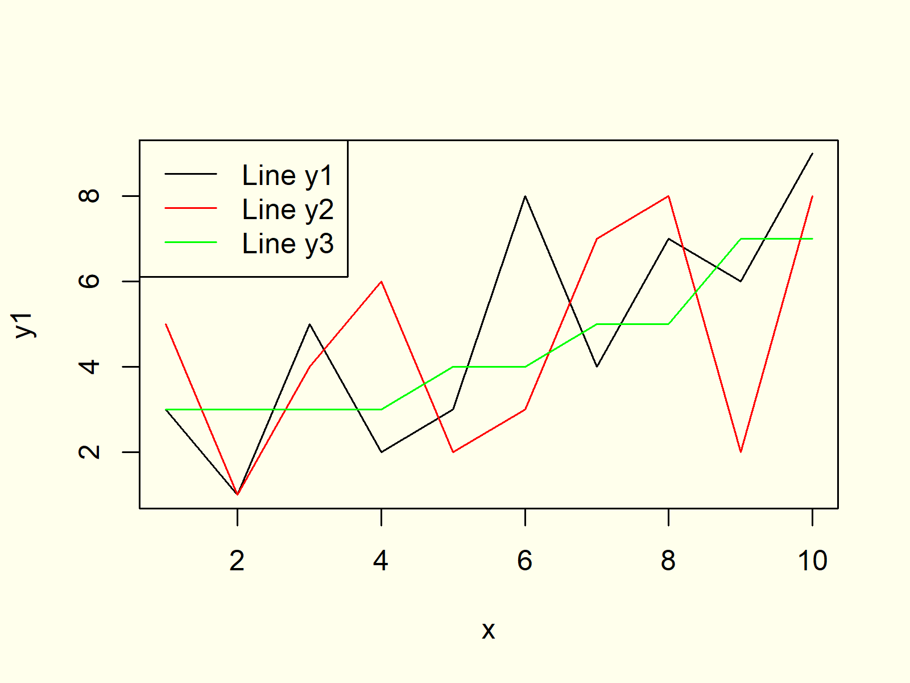

# cour : 

## 1. **introduction:**

La représentation graphique en R est l'un des points forts de ce langage de programmation statistique. R offre une multitude d'outils et de bibliothèques dédiés à la création de graphiques et de visualisations. Voici une introduction aux représentations graphiques en R :

### 1.1 Principaux Outils et Caractéristiques :

1. **ggplot2 :**
   - **Description :** `ggplot2` est une bibliothèque de graphiques qui permet de créer des visualisations complexes avec une syntaxe simple et cohérente. Elle repose sur la grammaire des graphiques (Grammar of Graphics) pour faciliter la création de graphiques esthétiquement plaisants.

2. **Base R Graphics :**
   - **Description :** R offre également des fonctions graphiques de base qui permettent de créer des graphiques simples sans utiliser de bibliothèques externes. Ces fonctions incluent `plot`, `hist`, `barplot`, etc.

### 1.2 Puissance de R en Représentation Graphique :

1. **Flexibilité :**
   - R offre une grande flexibilité pour personnaliser chaque aspect des graphiques, y compris les titres, les axes, les légendes, les couleurs, etc.

2. **Diversité des Graphiques :**
   - R permet de créer une large gamme de graphiques, notamment des diagrammes en barres, des histogrammes, des nuages de points, des graphiques linéaires, des graphiques à secteurs, des boîtes à moustaches, des graphiques en radar, etc.

3. **Interactivité :**
   - Certaines bibliothèques, comme `plotly` ou `shiny`, offrent des fonctionnalités interactives qui permettent à l'utilisateur d'explorer les données à travers des graphiques dynamiques.

4. **Intégration de Données :**
   - R facilite l'intégration de données directement dans les graphiques, permettant une visualisation facile des résultats d'analyses statistiques.

### 1.3 Types de Graphiques Principaux :

1. **Diagramme en Barres (Barplot) :**
   - **Description :** Affiche les fréquences ou les proportions des catégories dans une série de barres verticales.


2. **Nuage de Points (Scatter Plot) :**
   - **Description :** Affiche la relation entre deux variables continues à l'aide de points dispersés dans un plan.


3. **Histogramme :**
   - **Description :** Représente la distribution des valeurs d'une variable continue en regroupant ces valeurs en intervalles.


4. **Graphique Linéaire (Line Chart) :**
   - **Description :** Connecte les points de données avec des lignes pour montrer la tendance d'une variable au fil du temps ou d'une autre variable continue.




5. **Diagramme à Secteurs (Pie Chart) :**
   - **Description :** Représente les proportions relatives de différentes catégories dans un cercle.


6. **Diagramme en Boîte (Boxplot) :**
   - **Description :** Affiche la distribution statistique des données et identifie les valeurs aberrantes à l'aide de boîtes et de moustaches.


7. **Heatmap :**
   - **Description :** Représentation visuelle des données sous forme de tableau de couleurs pour mettre en évidence les modèles ou les différences.


Ces représentations graphiques ne sont que la pointe de l'iceberg. Avec R, les possibilités sont étendues, et de nombreuses autres bibliothèques spécialisées existent pour répondre à des besoins spécifiques.


## 2. **la fonction ``plot``:**

### 2.1 **Introduction:**

>La fonction `plot` en R est une fonction de base qui permet de créer divers types de graphiques, tels que des nuages de points, des graphiques linéaires, des histogrammes, des diagrammes en barres, etc. 


- **Description :**
  La fonction `plot` est utilisée pour créer des graphiques de base en R. Les types de graphiques produits dépendent du type de données passées aux arguments `x` et `y`. Par exemple, si `x` et `y` sont des vecteurs numériques, `plot` créera un nuage de points. Si `y` est une fonction de `x`, cela produira un graphique linéaire.

- **Syntaxe :**
  ```R
  plot(x, y, ...)
  ```
  - `x` : Vecteur de valeurs pour l'axe des x.
  - `y` : Vecteur de valeurs pour l'axe des y.
  - `...` : Autres arguments optionnels pour personnaliser le graphique (couleurs, titres, étiquettes, etc.).

- **Exemple :**
  ```R
  # Exemple de nuage de points
  x <- c(1, 2, 3, 4, 5)
  y <- c(3, 5, 7, 2, 8)

  # Création d'un nuage de points
  plot(x, y)
  ```


### 2.2 **les Arguments du plot:**


1. **l'argument ``main``:**

L'argument `main` de la fonction `plot` en R est utilisé pour spécifier le titre principal (ou le titre) du graphique. Il permet d'ajouter un titre informatif au-dessus du graphique pour décrire son contenu ou son objectif. Voici comment utiliser cet argument :

```R
# Exemple d'utilisation de l'argument main
x <- c(1, 2, 3, 4, 5)
y <- c(3, 5, 7, 2, 8)

# Création d'un nuage de points avec un titre
plot(x, y, main="Nuage de Points")
```

2. **les arguments ``xlab`` et ``ylab``:**

Les arguments `xlab` et `ylab` de la fonction `plot` en R sont utilisés pour spécifier les étiquettes des axes X et Y du graphique, respectivement. Ces étiquettes permettent d'ajouter des descriptions informatives aux axes du graphique. Voici comment utiliser ces arguments :

```R
# Exemple d'utilisation des arguments xlab et ylab
x <- c(1, 2, 3, 4, 5)
y <- c(3, 5, 7, 2, 8)

# Création d'un nuage de points avec des étiquettes d'axes
plot(x, y, main="Nuage de Points", xlab="Axe des X (Étiquette X)", ylab="Axe des Y (Étiquette Y)")
```

3.  **l'argument ``col`` :** 

L'argument `col` de la fonction `plot` en R est utilisé pour spécifier la couleur des points dans le graphique. Cet argument accepte différentes formes de spécification de couleur, telles que des noms de couleur, des codes de couleur hexadécimaux ou des indices de palette de couleurs prédéfinie.

Voici comment utiliser l'argument `col` dans un exemple de nuage de points :

```R
# Exemple d'utilisation de l'argument col
x <- c(1, 2, 3, 4, 5)
y <- c(3, 5, 7, 2, 8)

# Création d'un nuage de points avec une couleur spécifiée
plot(x, y, main="Nuage de Points", xlab="Axe X", ylab="Axe Y", col="red")
```


Vous pouvez personnaliser la couleur en utilisant d'autres valeurs pour l'argument `col`, comme des noms de couleur prédéfinis (par exemple, "blue", "green", "purple"), des codes hexadécimaux (par exemple, "#FF0000" pour le rouge), ou des indices de palette de couleurs (par exemple, `col=2` pour la deuxième couleur de la palette par défaut).


4. **l'argument ``pch``:**

L'argument `pch` (pour "plot character") de la fonction `plot` en R est utilisé pour spécifier le type de symbole utilisé pour représenter les points dans le graphique. Cet argument accepte différents codes numériques ou caractères qui déterminent la forme du symbole.

Voici comment utiliser l'argument `pch` dans un exemple de nuage de points :

```R
# Exemple d'utilisation de l'argument pch
x <- c(1, 2, 3, 4, 5)
y <- c(3, 5, 7, 2, 8)

# Création d'un nuage de points avec un type de symbole spécifié
plot(x, y, main="Nuage de Points", xlab="Axe X", ylab="Axe Y", col="blue", pch=19)
```


- Voici les  valeurs  utilisées pour l'argument `pch` :


5. **les arguments ``xlim`` , ``ylim`` :**  

Les arguments `xlim` et `ylim` de la fonction `plot` en R sont utilisés pour définir les limites des axes X et Y du graphique, respectivement. Ils permettent de spécifier l'étendue des valeurs qui seront affichées sur chaque axe. Voici comment utiliser ces arguments dans un exemple :

```R
# Exemple d'utilisation des arguments xlim et ylim
x <- c(1, 2, 3, 4, 5)
y <- c(3, 5, 7, 2, 8)

# Création d'un nuage de points avec des limites d'axes spécifiées
plot(x, y, main="Nuage de Points", xlab="Axe X", ylab="Axe Y", col="blue", pch=19, xlim=c(0, 6), ylim=c(0, 10))
```
- `xlim=c(0, 6)` spécifie les limites de l'axe X de 0 à 6.
- `ylim=c(0, 10)` spécifie les limites de l'axe Y de 0 à 10.

En ajustant les valeurs de `xlim` et `ylim`, vous pouvez contrôler quels intervalles de valeurs seront visibles sur le graphique, aidant ainsi à mieux visualiser vos données. Ces arguments sont particulièrement utiles lorsque vous souhaitez zoomer sur une partie spécifique de vos données.

6. **l'argument ``bty`` :**

L'argument `bty` (pour "box type") de la fonction `plot` en R est utilisé pour spécifier le type de boîte (encadrement) autour du graphique. Cet argument contrôle la forme de la boîte qui entoure l'ensemble du graphique. Voici comment utiliser cet argument dans un exemple :

```R
# Exemple d'utilisation de l'argument bty
x <- c(1, 2, 3, 4, 5)
y <- c(3, 5, 7, 2, 8)

# Création d'un nuage de points avec une boîte rectangulaire autour
plot(x, y, main="Nuage de Points", xlab="Axe X", ylab="Axe Y", col="blue", pch=19, bty="n")
```
`bty="n"` spécifie qu'aucune boîte ne doit être dessinée autour du graphique.


- L'argument `bty` de la fonction `plot` en R accepte plusieurs valeurs, chacune correspondant à un type de boîte différente autour du graphique:

    - **"o" (par défaut) :** Boîte rectangulaire standard. C'est la valeur par défaut si aucune autre n'est spécifiée.

    - **"l" :** Boîte de type ligne. La boîte est formée par des lignes plutôt qu'un rectangle.

    - **"7" :** Boîte en forme de "7". Elle ressemble à la boîte rectangulaire, mais avec une extrémité en forme de "7".

    - **"c" :** Boîte de type caractère. La boîte est formée par des caractères.

    - **"u" :** Boîte en forme de "U". Elle ressemble à la boîte rectangulaire, mais avec une extrémité en forme de "U".

    - **"n" :** Pas de boîte. Aucune boîte n'est dessinée autour du graphique.

7. **l'argument ``type``:**

- L'argument `type` de la fonction `plot` en R est utilisé pour spécifier le type de graphique à dessiner. Il détermine le type de tracé ou de représentation graphique des données. 

- **Syntaxe :**
    ```R
    plot(x, y, type="val")
    ```

- Voici quelques-unes des valeurs possibles pour l'argument `type` :

    - **"p" (par défaut) :** Nuage de points (scatter plot). Dessine des points pour chaque paire de valeurs dans les données.
    
    - **"l" :** Tracé de lignes. Connecte les points avec des lignes.
    
    - **"b" :** Points reliés par des lignes (mais les lignes ne touchent pas les points ). 
    
    - **"c" :** est utilisée pour tracer uniquement la partie des lignes de `type = "b"` 
    
    - **"o":** combine à la fois le nuage de points ("p") et le tracé de lignes ("l").

    - **"h" :** Histogramme. Dessine un histogramme des données.
    
    - **"s" :** Tracé en échelle. Utilisé pour les séries chronologiques.

    - **"S":** Tracé en échelle l'inverse du "s"
    
    - **"n" :** Aucun tracé. Utilisé pour créer un espace graphique sans afficher de données.


8. **l'argument ``lty``:**

- L'argument `lty` (pour "line type") dans la fonction `plot()` en R est utilisé pour spécifier le type de ligne à utiliser pour le tracé. Cet argument permet de personnaliser l'apparence de la ligne dans le graphique.


- Voici comment vous pouvez l'utiliser :

   ```R
   # Exemple : Utilisation de l'argument lty dans la fonction plot
   x <- 1:5
   y <- c(2, 4, 1, 3, 5)

   # Tracé d'un graphique avec une ligne de type pointillé
   plot(x, y, type="b", lty=2, col="blue", pch=16, main="Exemple de Graphique avec l'Argument lty")
   ```

   Dans cet exemple, l'argument `lty=2` est utilisé pour spécifier que la ligne doit être tracée en pointillés. Les valeurs de `lty` peuvent être des entiers ou des chaînes de caractères spécifiant différents types de lignes. 


- Voici quelques exemples courants :

   - `lty=1` ou `lty="solid"` : Ligne pleine (par défaut).
   - `lty=2` ou `lty="dashed"` : Ligne en pointillés.
   - `lty=3` ou `lty="dotted"` : Ligne en points.
   - `lty=4` ou `lty="dotdash"` : Alternance de points et de tirets.


9. **l'argument ``cex``:**

- L'argument `cex` dans la fonction `plot()` en R est utilisé pour spécifier le facteur de multiplication qui ajuste la taille des caractères dans le graphique en général. Le nom "cex" signifie "character expansion", ce qui indique qu'il est principalement utilisé pour contrôler la taille des caractères dans le graphique.

La valeur par défaut de `cex` est généralement 1.0. Si vous spécifiez `cex` avec une valeur supérieure à 1.0, les caractères seront agrandis, tandis qu'avec une valeur inférieure à 1.0, les caractères seront réduits.

- Voici un exemple d'utilisation de l'argument `cex` dans la fonction `plot()` :

```R
# Exemple : Utilisation de l'argument cex dans la fonction plot
x <- 1:5
y <- c(2, 4, 1, 3, 5)

# Tracé d'un graphique avec une taille de caractères personnalisée
plot(x, y, type="b", col="blue", pch=16, main="Graphique avec Taille de Caractères Personnalisée", cex=1.5)
```


## 3.  **Diagrammes:**

### 3.1 **Diagrammes en barres `barplot()`:**

1. **introduction:**

>Les diagrammes en barres sont des représentations graphiques qui affichent des données sous forme de barres rectangulaires, où la longueur de chaque barre est proportionnelle à la valeur qu'elle représente. Ces graphiques sont largement utilisés pour présenter des données catégorielles ou discrètes. 

- Voici quelques points clés sur les diagrammes en barres :

    **1. Types de données adaptés :**
    - Les diagrammes en barres sont particulièrement utiles pour visualiser des données catégorielles, où chaque catégorie est distincte et séparée.
    - Ils peuvent être utilisés pour représenter des données quantitatives discrètes, comme le nombre d'occurrences d'une catégorie ou le total d'une variable dans chaque catégorie.

    **2. Interprétation :**
    - La hauteur de chaque barre représente la quantité ou la fréquence associée à une catégorie spécifique.
    - Les barres peuvent être disposées horizontalement (diagrammes en barres horizontales) ou verticalement (diagrammes en barres verticales), en fonction des préférences et de la clarté de la représentation.

    **3. Comparaison entre catégories :**
    - Les diagrammes en barres facilitent la comparaison des quantités entre différentes catégories. On peut rapidement identifier les catégories avec les valeurs les plus élevées ou les plus basses.

    **4. Utilisation fréquente :**
    - Les diagrammes en barres sont couramment utilisés dans divers domaines tels que la statistique, l'économie, la finance, la recherche marketing, etc.
    - Ils peuvent être employés pour présenter des résultats d'enquêtes, des ventes par catégorie, des parts de marché, des fréquences d'événements, etc.

    **5. Types de barres :**
    - Diagrammes en barres simples : Chaque catégorie a une seule barre.
    - Diagrammes en barres groupées : Plusieurs barres sont regroupées pour chaque catégorie.
    - Diagrammes en barres empilées : Les barres sont empilées pour montrer la contribution de chaque sous-catégorie à la catégorie totale.

    **6. Précautions :**
    - Il est important d'éviter les distorsions visuelles et de commencer l'axe des valeurs à zéro pour éviter toute interprétation incorrecte.


2. **La fonction `barplot()` :**

>La fonction `barplot()` en R est utilisée pour créer des diagrammes en barres. Elle prend en entrée une ou plusieurs séries de données et génère un graphique en barres correspondant. 

Voici un exemple simple d'utilisation de `barplot()` :

```R
# Exemple d'utilisation de barplot
data <- c(3, 8, 5, 12, 7)
barplot(data, names = c("A", "B", "C", "D", "E"), col = "blue", main = "Bar Plot Example")
```

Dans cet exemple, le vecteur `data` représente les hauteurs des barres. L'argument `names.arg` spécifie les étiquettes des barres sur l'axe des x. L'argument `col` définit la couleur des barres, et l'argument `main` permet de spécifier le titre du graphique.


- **les arguments :**

La fonction `barplot()` en R est une fonction flexible avec plusieurs arguments qui permettent de personnaliser l'apparence du diagramme en barres. Voici quelques-uns des arguments principaux de la fonction `barplot()` :

   1. **height** :
      - **Description :** Vecteur numérique spécifiant la hauteur de chaque barre.
      - **Exemple :** `height=c(10, 20, 15, 25)`

   2. **names.arg** :
      - **Description :** Vecteur de chaînes de caractères spécifiant les étiquettes de l'axe des x.
      - **Exemple :** `names.arg=c('Groupe 1', 'Groupe 2', 'Groupe 3', 'Groupe 4')`

   3. **col** :
      - **Description :** Couleur ou palette de couleurs des barres.
      - **Exemple :** `col='blue'` ou `col=c('red', 'green', 'blue', 'yellow')`

   4. **border** :
      - **Description :** Couleur de la bordure des barres.
      - **Exemple :** `border='black'`

   5. **main** :
      - **Description :** Titre principal du graphique.
      - **Exemple :** `main='Diagramme à barres'`

   6. **xlab** :
      - **Description :** Étiquette de l'axe des x.
      - **Exemple :** `xlab='Groupes'`

   7. **ylab** :
      - **Description :** Étiquette de l'axe des y.
      - **Exemple :** `ylab='Fréquence'`

   8. **ylim** :
      - **Description :** Limites de l'axe des y (c'est-à-dire l'intervalle des valeurs affichées sur l'axe des y).
      - **Exemple :** `ylim=c(0, 30)`


   9. **width** :
      - **Description :** La largeur des barres.
      - **Exemple :** `width=0.8`

   10. **space** :
      - **Description :** L'espace entre les barres en unités d'axe.
      - **Exemple :** `space=0.2`

   11. **horiz** :
      - **Description :** Si `TRUE`, les barres sont tracées horizontalement.
      - **Exemple :** `horiz=TRUE`

   12. **angle** :
      - **Description :** L'angle d'inclinaison des étiquettes d'axe.
      - **Exemple :** `angle=45`


#### RQ : 

- Il existe de nombreux autres arguments que vous pouvez explorer pour personnaliser davantage votre graphique en barres. Pour obtenir une liste complète des arguments et des détails sur leur utilisation, vous pouvez consulter la documentation officielle en tapant `?barplot` dans la console R ou en visitant [la documentation en ligne](https://stat.ethz.ch/R-manual/R-devel/library/graphics/html/barplot.html).


### 3.2 **graphiques en secteurs  `pie()`:**


1. **introduction:**

>Un diagramme circulaire, également connu sous le nom de diagramme en secteurs , est une représentation graphique des données sous forme de cercle divisé en sections proportionnelles aux valeurs qu'elles représentent. Chaque section, ou secteur, du diagramme circulaire correspond à une catégorie spécifique, et l'angle du secteur est proportionnel à la quantité qu'il représente par rapport au total. Les diagrammes circulaires sont largement utilisés pour visualiser la répartition relative des parties d'un ensemble par rapport à l'ensemble complet.


- **Utilisation :**

   1. **Répartition proportionnelle :** Les diagrammes circulaires sont efficaces pour montrer la répartition proportionnelle des éléments d'un ensemble. Cela peut être utile pour illustrer la part de marché d'une entreprise, la distribution des dépenses dans un budget, ou la composition des différentes catégories dans un ensemble de données.

   2. **Comparaisons relatives :** Ils sont utiles pour comparer la contribution relative de différentes catégories sans la nécessité de comparer les valeurs numériques exactes. Cela permet de mettre en évidence visuellement les catégories les plus importantes par rapport aux autres.

   3. **Présentation visuelle :** Les diagrammes circulaires sont attrayants visuellement, ce qui les rend adaptés à la communication avec un public non technique. Ils peuvent être utilisés dans des présentations, rapports et supports visuels pour simplifier la compréhension des données.


2. **la fonction ``pie`` :**

>La fonction `pie()` en R est utilisée pour créer des graphiques en secteurs (pie charts), qui représentent les proportions relatives des différentes parties d'un ensemble.


Voici un exemple simple d'utilisation de la fonction `pie()` :

```R
# Exemple d'utilisation de pie()
data <- c(30, 15, 25, 10, 20)
labels <- c("A", "B", "C", "D", "E")
pie(data, labels = labels, main = "Pie Chart Example", col = rainbow(length(data)))
```

Dans cet exemple, le vecteur `data` contient les proportions des différentes parties, et le vecteur `labels` contient les étiquettes associées à chaque partie. L'argument `main` permet de spécifier le titre du graphique, et l'argument `col` définit la palette de couleurs utilisée pour les secteurs.

- **les arguments :**

La fonction `pie()` en R est utilisée pour créer des diagrammes circulaires. Voici quelques-uns des arguments les plus utiles de cette fonction :

   1. **x** :
      - **Description :** Un vecteur de données numériques représentant les proportions des différentes catégories.
      - **Exemple :** `x=c(30, 20, 50)`

   2. **labels** :
      - **Description :** Un vecteur de chaînes de caractères spécifiant les étiquettes associées à chaque section du diagramme.
      - **Exemple :** `labels=c("Catégorie A", "Catégorie B", "Catégorie C")`

   3. **main** :
      - **Description :** Titre principal du diagramme circulaire.
      - **Exemple :** `main="Répartition des catégories"`

   4. **col** :
      - **Description :** Une palette de couleurs pour les sections du diagramme circulaire.
      - **Exemple :** `col=c("red", "green", "blue")`

   5. **border** :
      - **Description :** La couleur de la bordure autour des sections.
      - **Exemple :** `border="white"`

   6. **radius** :
      - **Description :** Le rayon du cercle du diagramme circulaire.
      - **Exemple :** `radius=1`
 
   7. **labels.pos** :
      - **Description :** La position des étiquettes par rapport aux sections du diagramme circulaire.
      - **Exemple :** `labels.pos=c(0.5, 1.2, 1.5)`


#### RQ : 

- Vous pouvez consulter la documentation officielle de R pour en savoir plus sur les options disponibles : [Documentation de pie()](https://stat.ethz.ch/R-manual/R-devel/library/graphics/html/pie.html).


## 4. **Mise en forme:**

### 4.1 **la fonction ``legend()``:**

>La fonction `legend()` en R est utilisée pour ajouter une légende à un graphique. Une légende fournit des informations explicatives sur les éléments du graphique, tels que les couleurs, les lignes, ou les points, facilitant ainsi la compréhension du graphique par le lecteur. Voici une introduction à la fonction `legend()` et à certains de ses arguments principaux :

- **Syntaxe de base :**

```R
legend(x, y, legend, fill, col, pch, lty, cex, title, ...)
# ou 
legend("position", legend, fill, col, pch, lty, cex, title, ...)

```

- **Principaux arguments :**

   1. **x, y :**
      - **Description :** Les coordonnées (x, y) spécifiant l'emplacement de la légende sur le graphique. Ces valeurs peuvent être définies en fonction de l'endroit où vous souhaitez placer la légende sur le graphique.
      - **Exemple :** `x=1, y=2`

   2. **position:**
      - on peut  spécifier la position de la légende en utilisant les termes ``top``, ``left``, ``bottom`` ou ``right``.
      - Par exemple: ``legend("topright"), legend("bottomleft"), ou legend("bottomright")``

   3. **legend :**
      - **Description :** Un vecteur de chaînes de caractères spécifiant les étiquettes de la légende, correspondant aux éléments du graphique.
      - **Exemple :** `legend=c("Groupe A", "Groupe B", "Groupe C")`


   4. **pch :**
      - **Description :** La forme du point (caractère) utilisée pour représenter les éléments de la légende (si `legend` est utilisé pour des points).
      - **Exemple :** `pch=1` (cercle), `pch=2` (triangle), etc.

   5. **lty :**
      - **Description :** Le type de ligne utilisé pour représenter les éléments de la légende (si `legend` est utilisé pour des lignes).
      - **Exemple :** `lty=1` (ligne pleine), `lty=2` (ligne en pointillés), etc.

   6. **cex :**
      - **Description :** Un facteur de mise à l'échelle pour la taille des symboles dans la légende.
      - **Exemple :** `cex=1.2` (augmente la taille de la légende de 20%).

   7. **title :**
      - **Description :** Le titre de la légende.
      - **Exemple :** `title="Légende"`

   8. **inset :**
      - **Description:** L'argument `inset` dans la fonction `legend()` en R permet de spécifier les marges entre le bord de la légende et le bord du graphique. 
      - **Exemple:** ``inset=0.02``

   9. **col :**
      - **Description :** L'argument col dans la fonction legend() est utilisé pour spécifier la couleur des lignes ou des points dans la légende.
      - **Exemple :** `col=c("red", "green", "blue")`

   10.**``box.lty``:** 
      - **Description:** L'argument `box.lty` est utilisé pour personnaliser la boîte entourant la légende. 
      - **Exemple:** `box.lty=2`


- **Exemple :**

```R

temps <- seq(20 , 100 , 20)
projet.A <- c(25, 30 , 55 , 78 , 95)
projet.B <- c(15 , 25 , 45 , 60 , 80)

plot(temps , projet.A , type="b" , 
    main="Projet.A vs Projet.B" , xlab="Temps d'étude" , ylab="Resultat" ,
    xlim=c(0,100) , ylim=c(0,100) , lty=1 , col="red" , pch=16)
lines(temps , projet.B , type="b" ,
      lty=2 , col="blue" , pch=19 )
# legend du graphe 
legend("topleft" , title="legend" , c("A" , "B")
       , col = c("red", "blue") ,pch=c(16,19) , lty=c(1,2) , inset=0.02)

```


## 5. **la fonction ``axis()``:**

>La fonction `axis()` en R est utilisée pour ajouter des axes à un graphique. Elle permet de personnaliser les caractéristiques des axes, y compris les emplacements des étiquettes, les étiquettes elles-mêmes, le style des lignes des axes, etc. 

- La syntaxe générale de la fonction `axis()` est la suivante :

```R
axis(side, at = NULL, labels = TRUE, pos = NULL, tick = TRUE, line = NA, outer = FALSE, font = NA, lty = 1, col = NULL, ...)
```

- **`side` :** Spécifie le côté de la boîte graphique où l'axe doit être dessiné (1 pour en bas, 2 pour à gauche, 3 pour en haut, 4 pour à droite).

- **`at` :** Vecteur spécifiant les positions des marqueurs sur l'axe.

- **`labels` :** Si TRUE, des étiquettes sont dessinées à côté des marqueurs sur l'axe.

- **`tick` :** Si FALSE, les marqueurs (|) ne seront pas dessinés 

- **`font` :** La taille de la police pour les étiquettes d'axe.

- **`lty` :** Le type de ligne utilisé pour dessiner les axes.

- **`col` :** Couleur des axes.


- Voici un exemple d'utilisation de la fonction `axis()` :

```R
# Exemple : Utilisation de la fonction axis
x <- 1:5
y <- c(2, 4, 1, 3, 5)

# Tracé d'un graphique sans axe x initial
plot(x, y, type="b", xaxt="n", col="blue", pch=16, main="Exemple de Graphique avec axis")

# Ajout d'un axe x personnalisé
axis(1, at=x, labels=c("A", "B", "C", "D", "E"), col="red", lty=2)
```


## 6. **la fonction ``lines()``:**

>La fonction `lines()` en R est utilisée pour ajouter des lignes supplémentaires à un graphique existant. Cette fonction est souvent utilisée après la création initiale d'un graphique à l'aide de la fonction `plot()` ou d'autres fonctions de tracé.

- Voici la syntaxe générale de la fonction `lines()` :

```R
lines(x, y = NULL, type = "l", ...)
```

- **`x` :** Vecteur des coordonnées x.
- **`y` :** Vecteur des coordonnées y.
- **`type` :** Type de ligne à dessiner (`"l"` pour ligne, `"p"` pour points, `"b"` pour les deux, etc.).
- **`...` :** Autres paramètres graphiques qui peuvent être spécifiés.

- Exemple d'utilisation de la fonction `lines()` :

```R
# Exemple : Utilisation de la fonction lines
x <- 1:5
y <- c(2, 4, 1, 3, 5)

# Tracé initial avec plot
plot(x, y, type="b", col="blue", pch=16, main="Exemple de Graphique avec lines")

# Ajout d'une ligne avec la fonction lines
lines(x, y, col="red", lty=2)
```

## 7. **la fonction ``abline()``:**

>La fonction `abline()` en R est utilisée pour ajouter une ligne à un graphique, généralement de type `plot()`, `scatterplot()`, ou autre type de graphique bidimensionnel. La ligne peut être ajoutée avec une pente et une ordonnée à l'origine spécifiées ou avec une équation linéaire existante.
 
- Voici la syntaxe générale de la fonction `abline()` :

```R
abline(a = NULL, b = NULL, h = NULL, v = NULL, reg = NULL, coef = NULL, untf = FALSE, ...)
```

- **`a` et `b` :** Les coefficients de l'équation de la ligne (`y = a + b*x`).

- **`h` et `v` :** Les coordonnées horizontales (`h`) ou verticales (`v`) pour ajouter une ligne horizontale ou verticale.

- **`reg` :** Un modèle de régression linéaire dont les coefficients sont utilisés pour dessiner une ligne.

- **`coef` :** Les coefficients de l'équation de la ligne si `reg` n'est pas spécifié.

- **`untf` :** Si TRUE, les échelles des axes x et y sont considérées équivalentes.


- Exemple d'utilisation de la fonction `abline()` :

```R


# la fonction abline 

x <- 1:5
y <- c(2 , 14 , 7 , 8 , 2)
plot(x , y , type="b" , col="red" , main="la fonction abline" , pch=16)

# on ajoute une droite horiz
abline(h=10 , lty=2 , col="blue" )
abline(h = 3, col = "red", lty = 2)  # Ligne horizontale à y = 3 en rouge et en pointillés
abline(v = 3, col = "green", lty = 3)  # Ligne verticale à x = 3 en vert et en tirets
abline(a = 0, b = 1, col = "purple", lty = 1)

```


## 8. **la fonction ``title``:**

>La fonction `title()` en R est utilisée pour ajouter ou personnaliser les titres des axes et du graphique dans un graphique. Elle permet de spécifier les titres pour l'axe des x, l'axe des y, le titre principal et, si nécessaire, le sous-titre.

- Voici la syntaxe générale de la fonction `title()` :

```R
title(main = NULL, sub = NULL, xlab = NULL, ylab = NULL, line = NA, outer = FALSE, col.main = NULL, col.sub = NULL, col.lab = NULL, col.axis = NULL, ...)
```

- **`main` :** Le titre principal du graphique.

- **`sub` :** Le sous-titre (situé sous le titre principal).

- **`xlab` :** Le titre de l'axe des x.

- **`ylab` :** Le titre de l'axe des y.

- **`col.main`, `col.sub`, `col.lab`, `col.axis` :** Les couleurs pour le texte du titre principal, du sous-titre, des titres d'axes x et y.


- **Exemple d'utilisation de la fonction `title()` :**

```R
# Exemple : Utilisation de la fonction title
x <- 1:5
y <- c(2, 4, 1, 3, 5)

# Tracé d'un graphique avec des titres personnalisés
plot(x, y, type="b", col="blue", pch=16)

# Ajout de titres avec la fonction title
title(main = "la fonction titile", sub = "Sous-titre", xlab = "Axe X", ylab = "Axe Y", col.main = "red", col.sub = "green", col.lab = "purple", col.axis = "orange")
```


## 9. **la fonction ``par``:**

### 9.1 **introduction:**

>La fonction `par()` en R est utilisée pour spécifier et récupérer les paramètres graphiques globaux dans un environnement graphique. Ces paramètres déterminent l'apparence visuelle des graphiques créés avec les fonctions graphiques de base de R, telles que `plot()`, `barplot()`, `hist()`, etc.

- Voici la syntaxe générale de la fonction `par()` :

```R
par(...)
```

L'argument `...` représente une série d'autres paramètres graphiques qui peuvent être spécifiés. 

### 9.2 **les arguments de la fonction ``par``:**

1. **`mfrow` et `mfcol` :**
   
   - **`mfrow` :** `mfrow` spécifie le nombre de lignes et de colonnes pour disposer les graphiques. Il prend un vecteur de deux éléments où le premier élément est le nombre de lignes et le deuxième élément est le nombre de colonnes.

      Exemple :
      ```R
      par(mfrow=c(2, 2))
      ```

      Cela spécifie que vous souhaitez disposer les graphiques sur une grille de 2 lignes par 2 colonnes.

   - **`mfcol` :** `mfcol` est similaire à `mfrow`, mais il spécifie le nombre de colonnes et de lignes.

      Exemple :
      ```R
      par(mfcol=c(2, 2))
      ```

      Cela spécifie que vous souhaitez disposer les graphiques sur une grille de 2 colonnes par 2 lignes.

   La principale différence réside dans l'ordre dans lequel les graphiques sont remplis. Avec `mfrow`, les graphiques sont remplis par lignes, c'est-à-dire de gauche à droite, puis de haut en bas. Avec `mfcol`, les graphiques sont remplis par colonnes, c'est-à-dire de haut en bas, puis de gauche à droite.

   Exemple d'utilisation de `mfrow` et `mfcol` :

   ```R
   # Utilisation de mfrow
   par(mfrow=c(2, 2))
   plot(1:10, main="Graphique 1")
   plot(1:10, main="Graphique 2")
   plot(1:10, main="Graphique 3")
   plot(1:10, main="Graphique 4")

   # Réinitialisation des paramètres par défaut
   par(mfrow=c(1, 1))

   # Utilisation de mfcol
   par(mfcol=c(2, 2))
   plot(1:10, main="Graphique 1")
   plot(1:10, main="Graphique 2")
   plot(1:10, main="Graphique 3")
   plot(1:10, main="Graphique 4")

   # Réinitialisation des paramètres par défaut
   par(mfcol=c(1, 1))
   ```

Dans cet exemple, `par(mfrow=c(2, 2))` crée une disposition en 2x2, tandis que `par(mfcol=c(2, 2))` crée également une disposition en 2x2, mais l'ordre de remplissage des graphiques est différent.

**fig mfrwo:**
   
   

**fig mfcol:**
   
   


2. **`oma` et `mar` :** 

   Les arguments `oma` (outer margins) et `mar` (margins) dans la fonction `par()` de R sont utilisés pour spécifier les marges extérieures et intérieures d'un graphique respectivement.

   - **`oma` (outer margins) :** `oma` contrôle les marges extérieures du graphique, c'est-à-dire l'espace entre le graphique et le bord de la fenêtre graphique. Il s'agit d'un vecteur de quatre éléments spécifiant les marges extérieures dans l'ordre ``c(bottom, left, top, right)``.

      Exemple :
      ```R
      par(oma=c(1, 1, 1, 1))
      ```

      Cela spécifie une marge extérieure d'une unité d'unité graphique sur tous les côtés du graphique.

   - **`mar` (margins) :** `mar` contrôle les marges intérieures du graphique, c'est-à-dire l'espace entre le bord du graphique et les éléments tels que les axes, les étiquettes, etc. Il s'agit d'un vecteur de quatre éléments spécifiant les marges intérieures dans l'ordre (en bas, à gauche, en haut, à droite).

      Exemple :
      ```R
      par(mar=c(2, 2, 2, 2))
      ```

      Cela spécifie une marge intérieure d'une unité d'unité graphique en bas, à gauche, en haut et à droite du graphique.


3. **`cex` :** Facteur de multiplication pour ajuster la taille des caractères dans le graphique.

4. **`cex.lab`, `cex.axis`, `cex.main` :** Facteurs de multiplication pour ajuster la taille des caractères des étiquettes d'axe, des valeurs numériques sur les axes, et du titre principal respectivement.

5. **`las` :** Orientation des étiquettes d'axe (1 pour horizontal, 2 pour vertical, 3 pour incliné à 45 degrés).


### 9.3 **Exemple:**

Voici un exemple d'utilisation de la fonction `par()` pour ajuster certains paramètres graphiques globaux :

```R
# Sauvegarde des paramètres graphiques par défaut
def.par <- par(no.readonly = TRUE)

# Exemple : Utilisation de la fonction par pour ajuster les paramètres graphiques
par(mfrow=c(2, 2), mar=c(2, 2, 2, 2), oma=c(1, 1, 1, 1), cex=1.2)

# Tracé de plusieurs graphiques dans une disposition de tracé
plot(1:10, main="Graphique 1", col="blue", pch=16)
hist(rnorm(100), main="Histogramme", col="green")
boxplot(rnorm(100), main="Boîte à moustaches", col="orange")
barplot(table(sample(letters, 100, replace=TRUE)), main="Diagramme à barres", col="purple")

# Restauration des paramètres graphiques par défaut
par(def.par)
```

Dans cet exemple, nous utilisons `par()` pour définir plusieurs paramètres graphiques globaux avant de créer une disposition de tracé avec plusieurs graphiques. Une fois les graphiques créés, nous utilisons `par(def.par)` pour restaurer les paramètres graphiques par défaut.


## 10 . **la fonction ``curve``:**

>La fonction `curve()` en R est utilisée pour tracer des courbes mathématiques sur un graphique. Elle est particulièrement utile lorsque vous souhaitez visualiser des fonctions mathématiques sous forme de courbes dans un graphique.

- **Voici la syntaxe générale de la fonction `curve()` :**

```R
curve(expr, from = NULL, to = NULL, n = 101, add = FALSE, col = NULL, type = "l", lty = 1, lwd = 1, ...)
```

- `expr` : Expression de la fonction mathématique à tracer.
- ``from`` , ``to``	 :la plage sur laquelle la fonction sera tracée.
- `n` : Nombre de points à évaluer le long de la courbe.
- `add` : Si TRUE, la courbe est ajoutée à un graphique existant.
- `col` : Couleur de la courbe.
- `type` : Type de tracé (par exemple, "p" pour points, "l" pour lignes).
- `lty` : Type de ligne.
- `lwd` : Largeur de la ligne.


- **Voici un exemple simple de l'utilisation de `curve()` :**

```R
# la fonction curve 
curve (exp(x) , from = -3 , to = 3 , col="red" , lty=2)
abline(v=0 , col="blue" , lty=2)
curve(x^2, from = -3, to = 3, col = "blue",add = TRUE ,  lwd = 1, main = "Tracé de la fonction quadratique")


```

