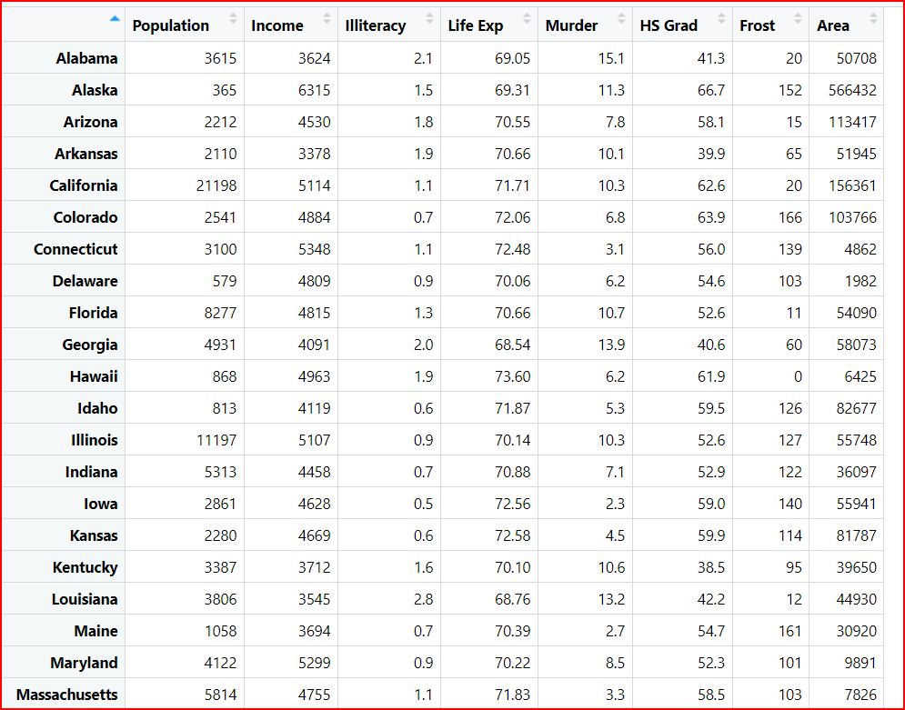

# cour 07 : **``dataframe``:**

## 1. **Introduction:**

### 1.1 .**Definition:**

- **Definition:**

    >Une ``data frame`` en R est une structure de données tabulaire bidimensionnelle, similaire à une table de base de données . Elle est utilisée pour stocker des données de manière organisée, où chaque colonne peut contenir des variables différentes, et chaque ligne représente une observation ou une entrée unique. Une data frame est une structure de données très polyvalente et est largement utilisée dans l'analyse de données et la programmation statistique en R.


- **Exemple:**
    
    

- **Caractéristiques clés d'une data frame :**

    - **Bidimensionnelle :** Elle a des lignes et des colonnes, ce qui permet de représenter des données tabulaires de manière structurée.

    - **Colonnes hétérogènes :** Chaque colonne peut contenir des données de types différents (numériques, caractères, facteurs, etc.).

    - **Nom de colonne :** Chaque colonne a un nom, facilitant l'accès aux variables.

    - **Index de ligne :** Chaque ligne a un index, permettant d'accéder à des observations spécifiques.


### 1.2 **crér une data frame:la fonction ``data.frame``**

- **Description:**

    >La fonction `data.frame()` en R est utilisée pour créer une data frame, qui est une structure de données bidimensionnelle composée de colonnes de types différents. 
    
- **La syntaxe générale de la fonction `data.frame()` est la suivante :**

    ```R
    data.frame(vec1 , vec2 , ..., row.names = NULL)
    ```

    - Les points de suspension (`...`) représentent les vecteurs ou les colonnes que vous souhaitez inclure dans la data frame. Vous pouvez spécifier autant de colonnes que nécessaire, et chaque colonne peut être un vecteur de n'importe quel type de données (numérique, caractère, facteur, etc.).


- **Exemple 1 d'utilisation de `data.frame()` :**

    ```R
    # Création d'une data frame simple
    donnees <- data.frame(
        Nom = c("Alice", "Bob", "Charlie", "David"),
        Age = c(25, 30, 22, 35),
        Score = c(92, 85, 78, 95)
    )
    ```

    Dans cet exemple, la data frame `donnees` est créée avec trois colonnes : "Nom", "Age", et "Score". Chaque colonne est constituée d'un vecteur correspondant.

- **Exemple 2:**

    ```R

        days <- c('Mon' ,'Tue' , 'Wed'  ,'Thur' , 'Fri')
        temps <- c(22.2 , 21 , 23 , 24.3 , 25)
        rain <- c(T , T , F , F , T)

        df <- data.frame(days,temps , rain)
        df

    ```


    ```output
            days temps  rain
        1   Mon  22.2  TRUE
        2   Tue  21.0  TRUE
        3   Wed  23.0 FALSE
        4   Thur  24.3 FALSE
        5   Fri  25.0  TRUE
    ```

- Vous pouvez également spécifier des options supplémentaires, telles que `row.names`, qui permet de définir le nom des lignes. Par défaut, les lignes sont numérotées de 1 à n.

    ```R
    # Création d'une data frame avec des noms de ligne spécifiés
    donnees_avec_noms_ligne <- data.frame(
        Nom = c("Alice", "Bob", "Charlie", "David"),
        Age = c(25, 30, 22, 35),
        Score = c(92, 85, 78, 95),
        row.names = c("Obs1", "Obs2", "Obs3", "Obs4")
    )
    ```


### 1.3 **explorer une data frame:**


>Pour explorer une data frame en R, plusieurs fonctions sont utiles. Ces fonctions sont utiles pour obtenir rapidement un aperçu des données, explorer leur structure, et comprendre les premières et dernières observations. La visionneuse interactive (`View()`) est particulièrement pratique pour explorer des données plus importantes.


1. **`head()` :**
   
   - **Description :** La fonction `head()` est utilisée pour afficher les 6 premières lignes d'une data frame.
   
   - **Exemple :**

        ```R
        # Exemple avec la data frame mtcars
        head(mtcars)
        ```


2. **`tail()` :**
   
   - **Description :** La fonction `tail()` est utilisée pour afficher les 6 dernières lignes d'une data frame.
   
   - **Exemple :**

        ```R
        # Exemple avec la data frame iris
        tail(iris)
        ```


3. **`View()` :**
   
   - **Description :** La fonction `View()` permet d'ouvrir une fenêtre interactive affichant toutes les données de la data frame.
   
   - **Exemple :**

        ```R
        # Exemple avec la data frame mtcars
        View(mtcars)
        ```


4. **`str()` :**
   - **Description :** La fonction `str()` affiche la structure d'une data frame, montrant les types de données et les premières valeurs pour chaque colonne.
   
   - **Exemple :**

        ```R
        # Exemple avec la data frame women
        str(women)   
        ```

        ```output

            'data.frame':	15 obs. of  2 variables:
            $ height: num  58 59 60 61 62 63 64 65 66 67 ...
            $ weight: num  115 117 120 123 126 129 132 135 139 142 ..

        ```


5. **`summary()` :**
   
   - **Description :** La fonction `summary()` fournit un résumé statistique(min , max , mediane ..etc) des données de la data frame pour chaque colonne.
   
   - **Exemple :**

        ```R
        # Exemple avec la data frame mtcars
        summary(woman)
        ```

        ```output
        height         weight     
        Min.   :58.0   Min.   :115.0  
        1st Qu.:61.5   1st Qu.:124.5  
        Median :65.0   Median :135.0  
        Mean   :65.0   Mean   :136.7  
        3rd Qu.:68.5   3rd Qu.:148.0  
        Max.   :72.0   Max.   :164.0 

        
        ```

6. **Les fonctions `nrow()` et `ncol()`:**

    >Les fonctions `nrow()` et `ncol()` en R sont utilisées pour obtenir le nombre de lignes et de colonnes d'une data frame, respectivement.

    - **`nrow()` :**
        - **Description :** La fonction `nrow()` renvoie le nombre de lignes dans une data frame.
        - **Syntaxe :** `nrow(x)`
        - **Exemple :**
            ```R
            # Création d'un exemple de data frame
            donnees <- data.frame(
                Nom = c("Alice", "Bob", "Charlie"),
                Age = c(25, 30, 22),
                Score = c(92, 85, 78)
            )
            
            # Obtenir le nombre de lignes
            nombre_lignes <- nrow(donnees)
            ```

    - **`ncol()` :**
        - **Description :** La fonction `ncol()` renvoie le nombre de colonnes dans une data frame.
        - **Syntaxe :** `ncol(x)`
        - **Exemple :**
            ```R
            # Création d'un exemple de data frame
            donnees <- data.frame(
                Nom = c("Alice", "Bob", "Charlie"),
                Age = c(25, 30, 22),
                Score = c(92, 85, 78)
            )
            
            # Obtenir le nombre de colonnes
            nombre_colonnes <- ncol(donnees)
            ```

7. **les fonctions  `colnames()`, et `rownames()`:**

    >les fonctions  `colnames()`, et `rownames()` sont utilisées pour obtenir des informations sur  les noms des colonnes et des lignes d'un data frame. 

    - **`colnames()` :**
        - **Description :** La fonction `colnames()` renvoie les noms des colonnes d'un data frame.
        - **Exemple :**

            ```R
            # Obtenir les noms des colonnes
            noms_colonnes <- colnames(donnees)
            
            #`noms_colonnes` contiendra un vecteur avec les noms des colonnes.
            ``` 

    - **`rownames()` :**
        - **Description :** La fonction `rownames()` renvoie les noms des lignes d'un data frame.
        - **Exemple :**

            ```R
            # Définir des noms pour les lignes
            rownames(donnees) <- c("Obs1", "Obs2", "Obs3")

            # Obtenir les noms des lignes
            noms_lignes <- rownames(donnees)
            # `noms_lignes` contiendra un vecteur avec les noms des lignes, dans cet exemple, c'est "Obs1", "Obs2", et "Obs3".
            ```


#### RQ : **Bultin-in data in R:**

- R est livré avec plusieurs ensembles de données intégrés, souvent utilisés pour des exemples pédagogiques et des démonstrations. Ces ensembles de données peuvent être utiles pour explorer et pratiquer diverses fonctions et techniques d'analyse de données en R , on peut y' accder avce la fonction ``data()`` .


## 2. **Indexing && selection:**


### 2.1 **Indexing dataframe:**

>L'indexation d'une data frame en R se fait à l'aide de crochets `[ ]` ou `$` et peut être réalisée de différentes manières en fonction de ce que vous souhaitez extraire. 

- **Indexation par Colonne :**

    >Vous pouvez accéder à une colonne spécifique d'une data frame en utilisant le nom de la colonne ou son indice. 
    
    - **Par exemple, pour extraire la colonne "Nom" de la data frame `donnees` :**

        ```R
        # Indexation par nom de colonne
        noms <- donnees$Nom # return : un vecteur 
        noms <- donnees[, "Nom"] # return : un vecteur 
        
        # ou
        # Indexation par nom colonne
        noms <- donnees["Nom"] # return : une data.frame
        ```


- **Indexation par Ligne :**

    >Vous pouvez accéder à une ligne spécifique d'une data frame en utilisant son indice. Par exemple, pour extraire la première ligne de la data frame `donnees` :

        ```R
        # Indexation par indice de ligne
        premiere_ligne <- donnees[1, ]
        ```

- **Indexation par Lignes et Colonnes :**

    >Vous pouvez également accéder à des parties spécifiques de la data frame en spécifiant à la fois les indices de lignes et de colonnes. 
    
    - **Exemple:**

        ```R
        # Indexation par lignes et colonnes
        valeurs <- donnees[1:5, c("Nom1" , "Nom2")]
        ```


### 2.2 **filter datframe:``subset``**

- **Description:**

    >La fonction `subset()` en R est utilisée pour créer un sous-ensemble (subset) d'une data frame en fonction de certaines conditions. Elle permet de filtrer les observations en utilisant des conditions logiques. 
    
- **La syntaxe générale de la fonction `subset()` est la suivante :**

    ```R
    subset(x, subset, select, ...)
    ```

    - `x`: La data frame d'origine.
    - `subset`: L'expression logique spécifiant les conditions pour sélectionner les observations.
    - `select`: Les colonnes à inclure dans le sous-ensemble.
    - `...`: Des arguments supplémentaires.

Voici quelques exemples d'utilisation de la fonction `subset()` :

- **Exemple 1 : Filtrer les observations en fonction d'une condition logique**

    ```R
    # Création d'une data frame
    donnees <- data.frame(
        Nom = c("Alice", "Bob", "Charlie", "David"),
        Age = c(25, 30, 22, 35),
        Score = c(92, 85, 78, 95)
    )

    # Filtrer les personnes ayant un score supérieur à 80
    sous_ensemble <- subset(donnees, Score > 80)
    ```

- **Exemple 2 : Sélectionner certaines colonnes dans le sous-ensemble**

    ```R
    # Filtrer et sélectionner seulement les colonnes "Nom" et "Age"
    sous_ensemble <- subset(donnees, select = c(Nom, Age))
    ```


### 2.3 **sort dataframe:``order()``**


- **la fonction ``order``:**

    - **Description:**
        
        >La fonction `order()` en R est utilisée pour obtenir les indices qui permettent de réorganiser un vecteur  dans un ordre spécifique. Elle renvoie les indices des éléments qui trieraient le vecteur  dans l'ordre spécifié. 
        
    - **La syntaxe générale de la fonction `order()` est la suivante :**

        ```R
        order(..., na.last = TRUE, decreasing = FALSE)
        ```

        - `...`: Les vecteurs, colonnes de data frame ou facteurs selon lesquels vous souhaitez effectuer le tri.
        - `na.last`: Un argument logique indiquant si les valeurs manquantes (`NA`) doivent être placées à la fin de l'ordre (par défaut, `TRUE`).
        - `decreasing`: Un argument logique indiquant si le tri doit être effectué par ordre décroissant (par défaut, `FALSE`).

    - **Exemple :**

        ```R
        # Exemple avec un vecteur
        vecteur <- c(10, 5, 8, 3, 7)
        indices_ordre <- order(vecteur)
        print(indices_ordre)
        vecteur_ordonne <- vecteur[indices_ordre]
        ```

        ```output
        [1] 4 2 5 3 1
        ```


- **ordonner une data.frame selone une colonne:**

    - **Description:**

        >Pour ordonner une data frame selon une colonne spécifique en utilisant la fonction `order()`, vous pouvez obtenir les indices d'ordonnancement en fonction de cette colonne, puis réorganiser la data frame en utilisant ces indices. 
        
        
    - **Syntaxe:**    

        ```R
        df[order(df$nom_colonne) , ] # trier la dataframe selon "nom_colonne" par ordre croissante 

        df[order(-df$nom_colonne) , ] # trier la dataframe selon "nom_colonne" par ordre decroissante 


       # trier la dataframe selon "nom_colonne_1" par ordre croissante et en cas d'égalite entre deux valeures du colonne_1 on le trier par ordre croistante selon les  valeures de la colonne_2
        df[order(df$nom_colonne_1 , df$nom_colonne_2) , ]


        ```
    
    - **Voici un exemple :**

        Supposons que vous avez une data frame appelée `donnees` avec les colonnes "Nom", "Age", et "Score". Vous souhaitez ordonner la data frame en fonction de la colonne "Score".

        ```R
        # Création d'une data frame
        donnees <- data.frame(
        Nom = c("Alice", "Bob", "Charlie", "David"),
        Age = c(25, 30, 22, 35),
        Score = c(92, 85, 78, 95)
        )

        # Obtenir les indices d'ordonnancement selon la colonne "Score"
        indices_ordre <- order(donnees$Score)

        # Utiliser les indices pour réorganiser la data frame
        donnees_ordonees <- donnees[indices_ordre, ]
        ```

        Maintenant, `donnees_ordonees` contiendra la data frame `donnees` ordonnée en fonction des valeurs croissantes de la colonne "Score". 


## 3. **Ajouter à une data frame:**


### 3.1 **Ajouter une ligne:**

- La fonction `rbind()` en R est utilisée pour ajouter des lignes à une data frame existante. Elle combine deux data frames par lignes, ajoutant ainsi les observations du second data frame à la fin du premier. 


- **Voici comment utiliser `rbind()` pour ajouter une ligne à une data frame :**

    ```R
    # Création d'un exemple de data frame
    donnees <- data.frame(
        Nom = c("Alice", "Bob", "Charlie"),
        Age = c(25, 30, 22),
        Score = c(92, 85, 78)
    )


    # Création d'une nouvelle ligne à ajouter
    nouvelle_ligne <- c("David", 35, 95)

    # Utilisation de rbind pour ajouter la nouvelle ligne à la data frame
    donnees <- rbind(donnees, nouvelle_ligne)

    # Affichage de la data frame après l'ajout de la nouvelle ligne
    print(donnees)
    ```

    Dans cet exemple, une nouvelle ligne `nouvelle_ligne` est créée en utilisant un vecteur de valeurs correspondant aux colonnes de la data frame d'origine. Ensuite, la fonction `rbind()` est utilisée pour ajouter cette nouvelle ligne à la data frame `donnees`.

### 3.2 **Ajouter une colonne:**


- **Utilisation de `cbind()` :**

    - **Syntaxe:**

        ```R
        df <- cbind(df , new_col)

        ```
    - **Exemple:**

        ```R
        # Création d'un exemple de data frame
        donnees <- data.frame(
            Nom = c("Alice", "Bob", "Charlie"),
            Age = c(25, 30, 22),
            Score = c(92, 85, 78)
        )

        # Création d'un nouveau vecteur pour la nouvelle colonne
        nouvelle_colonne <- c(1, 2, 3)

        # Utilisation de cbind pour ajouter la nouvelle colonne
        donnees <- cbind(donnees,  nouvelle_colonne)

        # Affichage de la data frame après l'ajout de la nouvelle colonne
        print(donnees)
        ```


- **Utilisation de la méthode d'affectation directe :**

    - **Syntaxe:**

        ```R
        df$new_col <- new_vec
        # ou 
        df[ , 'new_col'] <- new_vec

        ```
    - **Exemple:**

        ```R
        # Création d'un exemple de data frame
        donnees <- data.frame(
            Nom = c("Alice", "Bob", "Charlie"),
            Age = c(25, 30, 22),
            Score = c(92, 85, 78)
        )

        # Création d'un nouveau vecteur pour la nouvelle colonne
        nouvelle_colonne <- c(1, 2, 3)

        # Affectation directe de la nouvelle colonne
        donnees$NouvelleColonne <- nouvelle_colonne

        # Affichage de la data frame après l'ajout de la nouvelle colonne
        print(donnees)
        ```


## 4. **``clean data``:**

### 4.1 **Definition:**

>``clean data`` se réfère au processus de préparation  des données dans le but de les rendre appropriées et utilisables pour une analyse ou un traitement ultérieur. Nettoyer les données implique souvent plusieurs étapes, la gestion des valeurs manquantes  y compris la détection et la correction des erreurs, le traitement des doublons, la transformation des variables, et d'autres opérations visant à garantir la qualité et la fiabilité des données.

- En d'autres termes, le nettoyage des données vise à garantir que les données sont cohérentes, précises et prêtes à être utilisées pour des analyses statistiques, des modélisations, des visualisations ou d'autres tâches liées à l'exploration de données. Un jeu de données propre est essentiel pour obtenir des résultats fiables et significatifs dans le domaine de l'analyse de données et de l'apprentissage automatique.


### 4.2 **la présence de valeurs manquantes:**

- **`is.na()` && `any`:**

    vous pouvez utiliser la fonction `is.na()` conjointement avec la fonction `any()` pour vérifier la présence de valeurs manquantes dans un dataframe R. 

    - La fonction `is.na()` renvoie une matrice du même format que le dataframe, avec des valeurs logiques indiquant si chaque élément est manquant (`TRUE`) ou non (`FALSE`). 

    - En utilisant `any()`, vous pouvez agréger ces valeurs logiques pour vérifier s'il y a au moins une valeur manquante dans l'ensemble du dataframe.


- **Voici un exemple :**

    ```R
    # Création d'un exemple de dataframe avec des valeurs manquantes
    df <- data.frame(
    Colonne1 = c(1, 2, NA, 4),
    Colonne2 = c(5, NA, 7, 8)
    )

    # Vérification des valeurs manquantes
    if (any(is.na(df))) {
    cat("Le dataframe contient des valeurs manquantes.\n")
    } else {
    cat("Le dataframe ne contient pas de valeurs manquantes.\n")
    }
    ```

    Dans cet exemple, le dataframe `df` contient des valeurs manquantes. La condition `if (any(is.na(df)))` renverra `TRUE` car il y a au moins une valeur manquante dans le dataframe. 
    

### 4.3 **remplacer les valeurs manquantes:**


>Le choix de la technique pour remplacer les valeurs manquantes dépend du contexte spécifique de vos données et de l'impact que ces remplacements peuvent avoir sur votre analyse. Deux approches courantes sont de remplacer les valeurs manquantes soit par 0, soit par la moyenne (mean) des valeurs non manquantes. 


- **Remplacement par 0 :**

    ```R
    # Remplacer les valeurs manquantes par 0
    df[is.na(df)] <- 0

    # ou pour unr colonne spécifique : 
    df$col[is.na(df$col)] <- 0 
    ```

- **Remplacement par la moyenne :**

    ```R
    # Remplacer les valeurs manquantes par la moyenne
    df[is.na(df)] <- mean(df, na.rm = TRUE)

    # ou pour unr colonne spécifique : 
    df$col[is.na(df$col)] <- mean(df$col, na.rm = TRUE)
    ```


### RQ : 

- Cependant, il est important de noter que remplacer les valeurs manquantes par 0 peut avoir un impact significatif sur vos résultats, en particulier si les zéros ne sont pas des valeurs appropriées dans le contexte de vos données. Remplacer par la moyenne peut être moins susceptible de biaiser vos résultats, mais cela dépend également de la distribution de vos données.


## 5. **``Merging Data Frames:``**

>La fusion de dataframes en R, souvent appelée "merging", est le processus d'association de deux dataframes en fonction de certaines variables communes. Cela permet de combiner des informations provenant de différentes sources ou de différentes parties d'un ensemble de données.


- **la fonction ``merge()``:**

    - **Description :**
        La fonction `merge()` en R est utilisée pour fusionner deux dataframes en fonction des valeurs de colonnes spécifiées, créant ainsi un nouveau dataframe combiné. La fusion se fait généralement en utilisant des colonnes communes entre les deux dataframes. Cette fonction offre la possibilité de réaliser différents types de fusions, notamment les fusions internes (inner join), gauches (left join), droites (right join) et complètes (full join).
 

    - **Syntaxe :**
        La syntaxe de base de la fonction `merge()` est la suivante :

        ```R
        merge(x, y, by = NULL, by.x = NULL, by.y = NULL, all = FALSE, all.x = all, all.y = all, ...)
        ```

        - `x` : Le premier dataframe à fusionner.
        - `y` : Le deuxième dataframe à fusionner.
        - `by` : Un vecteur de noms de colonnes ou d'indices spécifiant les colonnes sur lesquelles effectuer la fusion. Si `by` est `NULL`, la fusion se fait sur toutes les colonnes ayant le même nom dans les deux dataframes.
        
        - `by.x` : Un vecteur de noms de colonnes ou d'indices spécifiant les colonnes à utiliser pour la fusion dans le dataframe `x`. Si `by.x` est spécifié et `by` est `NULL`, la fusion est effectuée sur les colonnes spécifiées dans `by.x`.

        - `by.y` : Un vecteur de noms de colonnes ou d'indices spécifiant les colonnes à utiliser pour la fusion dans le dataframe `y`. Si `by.y` est spécifié et `by` est `NULL`, la fusion est effectuée sur les colonnes spécifiées dans `by.y`.

        - `all` : Une valeur logique indiquant si la fusion doit inclure toutes les lignes (TRUE) ou seulement les lignes avec des correspondances (FALSE). Par défaut, `all` est `FALSE`.

        - `all.x` : Une valeur logique indiquant si toutes les lignes du dataframe `x` doivent être incluses dans le résultat, même si elles n'ont pas de correspondance dans `y`. Par défaut, `all.x` est égal à la valeur de `all`.

        - `all.y` : Une valeur logique indiquant si toutes les lignes du dataframe `y` doivent être incluses dans le résultat, même si elles n'ont pas de correspondance dans `x`. Par défaut, `all.y` est égal à la valeur de `all`.

        - `...` : D'autres paramètres optionnels.


    - **Exemple :**
        
        Considérons deux dataframes, `df1` et `df2`, que nous voulons fusionner sur la colonne "ID". Voici un exemple :

        ```R
        # Création de deux dataframes
        df1 <- data.frame(ID = c(1, 2, 3), Name = c("Alice", "Bob", "Charlie"))
        df2 <- data.frame(ID = c(2, 3, 4), Score = c(95, 88, 75))

        # Fusion des dataframes par la colonne "ID" (left join)
        merged_df <- merge(df1, df2, by = "ID", all.x = TRUE)

        # Affichage du dataframe fusionné
        print(merged_df)
        ```

        Dans cet exemple, `merge()` fusionne les dataframes `df1` et `df2` sur la colonne "ID" en utilisant un left join (`all.x = TRUE`). Cela signifie que toutes les lignes de `df1` seront incluses dans le résultat, même si elles n'ont pas de correspondance dans `df2`. Le résultat sera un nouveau dataframe (`merged_df`) combinant les informations des deux dataframes sur la colonne "ID".
