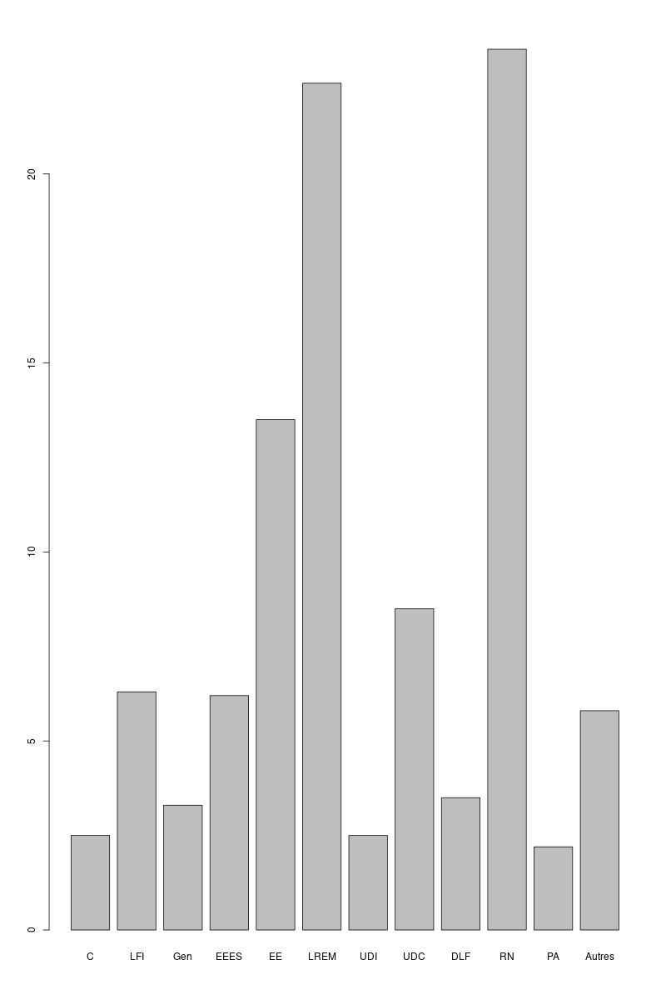
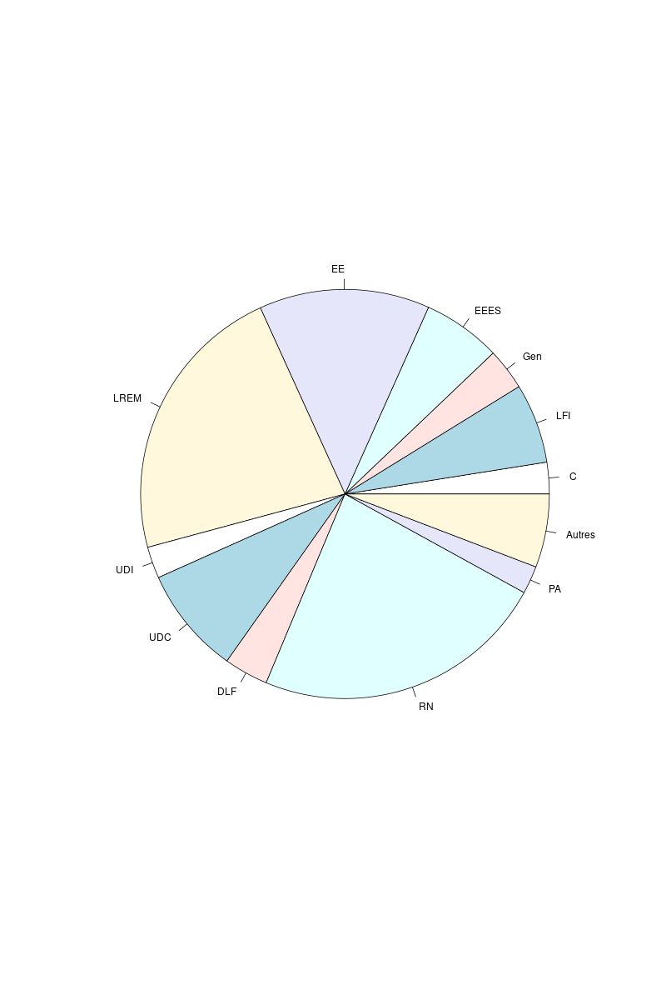
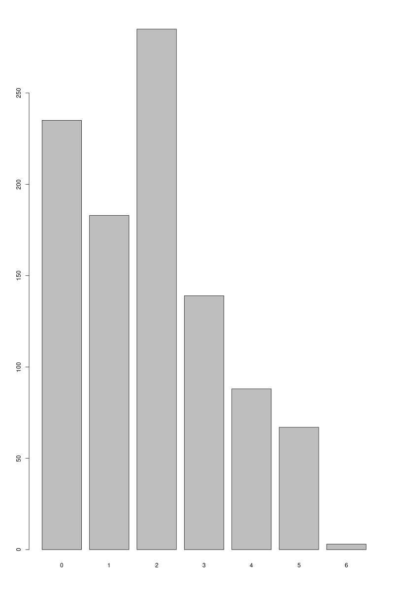

# cour : **Statistique Descriptive en R**

## 1. **Introduction:**

>``La statistique descriptive`` a pour but de résumer l’information contenue dans les données de façon à en dégager les caractéristiques essentielles sous une forme simple et intelligible. Les deux principaux outils de la statistique descriptive sont ``les représentations graphiques`` et ``les indicateurs statistiques``.

L'objectif de ce cours est d'apprendre comment réaliser la statistique descriptive en utilisant le langage de programmation R, en mettant particulièrement l'accent sur le calcul des indicateurs statistiques et la création de représentations graphiques, plus précisément les histogrammes et les graphes de probabilités. 

Avant de commencer, nous allons aborder certaines définitions importantes dans la statistique descriptive:

1. **Données :**
   - **Définition :** En statistique descriptive, les données font référence aux observations ou mesures collectées sur des individus ou des unités statistiques. Elles peuvent être de nature diverse, telles que des nombres, des catégories, ou d'autres formes de caractéristiques mesurables.

2. **Variables :**
   - **Définition :** Les variables représentent les caractéristiques spécifiques des individus ou unités statistiques qui sont mesurées ou observées. Ces caractéristiques peuvent être quantitatives (telles que la taille, le poids) ou qualitatives (telles que la couleur des yeux, la catégorie socio-professionnelle).

3. **Échantillon  :**
   - **Définition :** Un échantillon est un sous-ensemble sélectionné de la population totale. En statistique descriptive, on analyse souvent un échantillon plutôt que la population entière, en raison de contraintes de coût et de temps.

4. **Recensement  :**
   - **Définition :** Un recensement consiste à collecter des données sur l'ensemble de la population. Cependant, en pratique, il est rare d'effectuer un recensement complet en raison de contraintes logistiques, temporelles et financières.

5. **Sondage :**
   - **Définition :** Un sondage implique la sélection d'un échantillon représentatif d'une population plus large dans le but de généraliser les résultats de l'échantillon à l'ensemble de la population. Les sondages sont utilisés comme alternative plus pratique et économique au recensement.

6. **Statistique Unidimensionnelle  :**
   - **Définition :** La statistique unidimensionnelle concerne l'analyse de données où une seule variable est mesurée sur les individus. L'objectif est de résumer, décrire et visualiser les caractéristiques de cette variable unique.

7. **Statistique Multidimensionnelle :**
   - **Définition :** La statistique multidimensionnelle concerne l'analyse de données où plusieurs variables sont mesurées sur les mêmes individus. Elle explore les relations et les interactions entre ces variables pour obtenir une compréhension plus complète des données.


## 2. **Représentations graphiques:**


### 2.1. **Variables discrètes:**

>``Une variable discrète`` est une variable dont les valeurs appartiennent à un ensemble fini ou dénombrable. Cependant, l'ensemble des valeurs prises par cette variable dans un échantillon de taille n est nécessairement fini. Les variables qui sont exprimées en nombres réels sont appelées ``variables quantitatives`` ou numériques (par exemple : longueur, durée, coût, ...). Les variables qui sont exprimées par l'appartenance à une catégorie sont appelées ``variables qualitatives`` ou catégorielles (par exemple : couleur, catégorie , ...).


#### 2.1.1. **``Variables qualitatives``:**

- **modalités:**
    Si la variable est qualitative, on appelle **``modalités``** les valeurs possibles de cette variable.

    Exemple : 

    Par exemple, si la variable est la couleur des yeux d’un individu, l’ensemble des modalités est E = {bleu, vert, brun, pers, noir}. Si on interroge n = 200 personnes, les
    données brutes se présenteront sous la forme d’une suite du type : brun, vert, vert, bleu, ..., noir, vert. 
    Cette suite n’est pas lisible. La meilleure manière de représenter ces données est d’utiliser les fréquences absolues et relatives

Les fréquences absolues et relatives sont des concepts importants en statistique, particulièrement lors de l'analyse de variables qualitatives discrètes. Voici les définitions pour ces deux types de fréquences :

- **Fréquence Absolue :**
   - **Définition :** La fréquence absolue d'une modalité d'une variable qualitative discrète représente le nombre d'occurrences ou d'individus qui appartiennent à cette modalité. Elle est notée $n_i$, où i correspond à une modalité particulière.

   - **Formule :** 
     $$\text{Fréquence Absolue} (n_i) = \text{Nombre d'occurrences de la modalité } i$$

- **Fréquence Relative :**
   - **Définition :** La fréquence relative d'une modalité d'une variable qualitative discrète représente la proportion ou le pourcentage d'occurrences de cette modalité par rapport à l'ensemble des observations. Elle est notée $f_i$ .

   - **Formule :** 
     $$\text{Fréquence Relative} (f_i) = \frac{\text{Fréquence Absolue} (n_i)}{\text{Total des observations}} \times 100\%$$

    La fréquence relative est souvent exprimée en pourcentage pour faciliter la compréhension des proportions relatives des différentes modalités.


- **Représentation graphique:**

    La représentation graphique des variables qualitatives discrètes peut être réalisée à l'aide de diagrammes en colonnes (ou diagrammes en barres) et de diagrammes circulaires (ou camemberts). Ces deux types de graphiques permettent de visualiser la distribution des fréquences des différentes modalités d'une variable qualitative discrète. Voici une brève explication pour chacun :

    1. **Diagramme en Colonnes (ou Diagramme en Barres) :**
    - **Description :** Ce type de graphique utilise des colonnes (ou barres) pour représenter les fréquences absolues (ou relatives) des différentes modalités d'une variable qualitative discrète. Chaque colonne représente une modalité, et la hauteur de la colonne indique la fréquence associée.
    - **Utilisation :** Le diagramme en colonnes est particulièrement adapté pour comparer visuellement les fréquences des différentes modalités.


    2. **Diagramme Circulaire (ou Camembert) :**
    - **Description :** Ce type de graphique utilise un cercle divisé en secteurs, chaque secteur représentant une modalité de la variable qualitative. L'angle du secteur est proportionnel à la fréquence de la modalité. 
    - **Utilisation :** Le diagramme circulaire est utile pour illustrer la répartition relative des différentes modalités en pourcentages.
 

- **Exemple :** 

```R
data <- c(2.5, 6.3 ,3.3, 6.2 ,13.5 ,22.4, 2.5, 8.5, 3.5 ,23.3, 2.2, 5.8)
names <- c( 'C' , 'LFI', 'Gen' ,'EEES' ,'EE' ,'LREM', 'UDI', 'UDC', 'DLF', 'RN' ,'PA' ,'Autres')
names
barplot(data , names= names)
pie(data , labels=names)

```

        

#### 2.1.2. **``Variables quantitative``:**


Lorsque la variable est quantitative, on utilise les mêmes représentations à l’aide des fréquences absolues et relatives. La différence fondamentale entre les représentations pour des variables qualitatives et quantitatives tient au fait qu'il existe un **ordre naturel sur les modalités** (qui sont des nombres réels) pour les variables quantitatives, alors qu'aucun ordre n'est prédéfini pour les variables qualitatives. C’est pourquoi les diagrammes en bâtons sont toujours utilisés, mais pas les diagrammes sectoriels.

Par exemple, une enquête a été menée auprès de 1000 couples, en leur demandant notamment le nombre d'enfants. Le tableau suivant donne les fréquences, et la figure suivant présente le diagramme en bâtons, obtenu à l’aide de la commande ``barplot(c(235,183,285,139,88,67,3),names=c(0,1,2,3,4,5,6))``:

| Nombre d'enfants | Fréquence Absolue | Fréquence Relative |
|-------------------|-------------------|--------------------|
| 0                 | 235               | 23.5%              |
| 1                 | 183               | 18.3%              |
| 2                 | 285               | 28.5%              |
| 3                 | 139               | 13.9%              |
| 4                 | 88                | 8.8%               |
| 5                 | 67                | 6.7%               |
| 6                 | 3                 | 0.3%               |
| > 6               | 0                 | 0%                 |


```R
barplot(c(235,183,285,139,88,67,3),names=c(0,1,2,3,4,5,6))
```

  


### 2.2. **Variables continues:**

Une variable continue prend des valeurs dans un ensemble non dénombrable, tel que $\mathbb{R}$ ou $[a, b]$. Dans ce cas, les représentations du type diagramme en bâtons sont sans intérêt, car les données sont en général toutes distinctes, donc les fréquences absolues sont toutes égales à 1.

On considérera ici deux types de représentations graphiques :
- **L'histogramme.**
- **les graphiques de probabilités.**


#### 2.2.1 **Histogrammes:**


>``Un histogramme`` est une représentation graphique de la distribution d'une variable continue. Il divise la plage des valeurs de la variable en intervalles, puis trace des barres pour représenter le nombre ou la fréquence de observations tombant dans chaque intervalle. Les histogrammes sont largement utilisés en statistique pour visualiser la distribution des données et comprendre la répartition des valeurs dans un ensemble.


#### 2.2.2 **graphiques de probabilités:**


## 3. **les indicateurs statistiques:**


