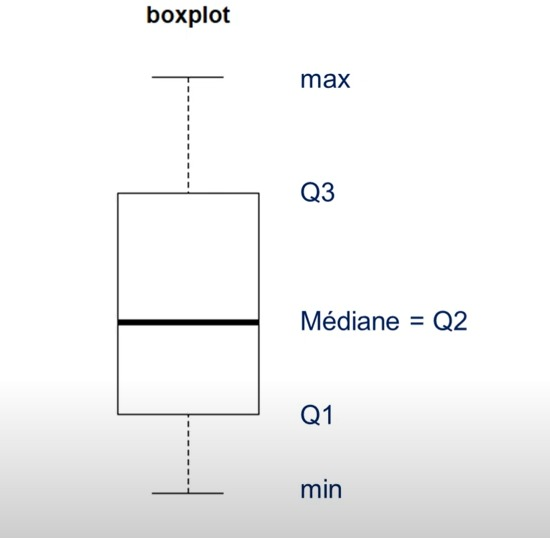

# cour : **``boxplot``**

Un boxplot, également appelé diagramme en boîte, est un type de graphique statistique qui permet de visualiser la distribution des données, en particulier la médiane, les quartiles et la présence d'éventuels écarts ou valeurs aberrantes. Il fournit une représentation graphique concise des principales caractéristiques d'une distribution.

Voici comment interpréter un boxplot :

1. **Boîte (Box) :** La boîte représente le quartile inférieur (Q1) et le quartile supérieur (Q3). La longueur de la boîte, appelée l'étendue interquartile (IQR), mesure la dispersion de la moitié centrale des données.

2. **Ligne médiane (Median) :** La ligne à l'intérieur de la boîte représente la médiane (ou le deuxième quartile, Q2). Elle indique la valeur médiane des données, séparant ainsi la moitié inférieure de la moitié supérieure.

3. **Moustaches (Whiskers) :** Les moustaches s'étendent à partir de la boîte jusqu'à une certaine distance des quartiles. Les moustaches peuvent être définies de différentes manières, mais une pratique courante est d'étendre les moustaches jusqu'à 1,5 fois l'IQR à partir des quartiles. Les points au-delà de ces moustaches peuvent être considérés comme des valeurs aberrantes potentielles.

4. **Points aberrants (Outliers) :** Les points au-delà des moustaches sont souvent représentés individuellement et sont considérés comme des valeurs aberrantes, c'est-à-dire des observations qui diffèrent significativement de la tendance générale des données.

Les boxplots sont utiles pour comparer visuellement la distribution des données entre différentes catégories ou groupes. Ils permettent également de détecter rapidement les valeurs aberrantes et de comprendre la dispersion des données. Les boxplots sont largement utilisés dans les domaines de la statistique, de l'économie, de la biologie et d'autres domaines où la visualisation des distributions de données est importante.

