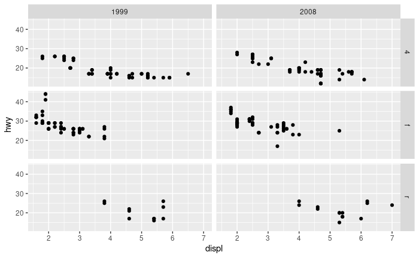
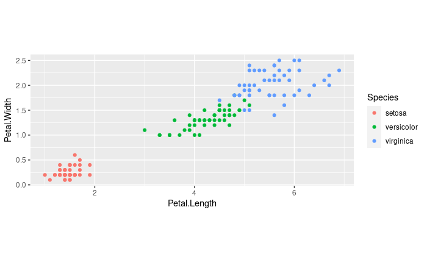
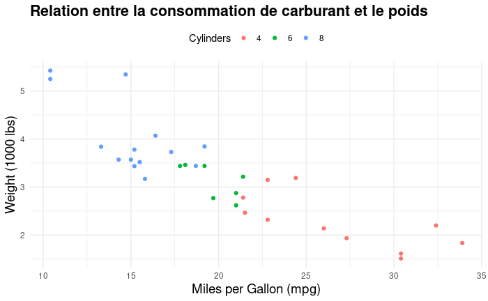

# cour : ``Introduction à ggplot2``


## 1. **Définition:**

>ggplot2 est une librairie R très populaire pour la création de graphiques et de visualisations de données. Développée par Hadley Wickham, ggplot2 est basée sur la grammaire des graphiques (``Grammar of Graphics``), ce qui signifie qu'elle repose sur un ensemble cohérent de règles et de principes pour construire des graphiques de manière intuitive et efficace.


## 2. **Les 7 couches  en ggplot2 :**

ggplot2 suit un paradigme de construction de graphiques en couches, ce qui signifie que vous pouvez ajouter des composants graphiques un par un pour créer des visualisations complexes et riches en informations. Les composants graphiques ajoutés en ggplot2 sont souvent regroupés en sept couches principales :

### 2.1. **``Data Layer`` :** 

- **Description:**

    >La couche de données (data layer) dans un graphique ggplot se réfère à la partie du code où vous spécifiez quel jeu de données utiliser pour créer le graphique. 

    - En  première étape on passe les données à la fonction ``ggplot()``, qui stocke les données à utiliser ultérieurement .

- **Syntaxe:**

    ```R
    ggplot(data = nom_data)

    ```


### 2.2 **``mapping layer``:**

- **Description:**

    >La couche de mappage (mapping layer) dans un graphique ggplot se réfère à la partie du code où vous spécifiez comment les variables de votre jeu de données doivent être représentées graphiquement. Cela inclut notamment la liaison entre les variables de votre jeu de données et les éléments graphiques tels que les axes, les couleurs, les formes, etc.

    - Dans ggplot, la couche de mappage est généralement spécifiée à l'aide de la fonction `aes()` (pour aesthetics). Cette fonction est utilisée à l'intérieur de la fonction `ggplot()` pour mapper les variables de votre jeu de données aux différentes esthétiques graphiques.

-  **Syntaxe:**

    ```R
    ggplot(data = nom_data, mapping = aes(x = var1, y = var2))
    ```

### 2.3 **``layers``:**

- **Description:**
    
    >La couche ``layers`` est l'élément fondamental de tout graphique dans ggplot. Elle prend les données mappées et les traduit visuellement en graphe. Cette couche se compose de trois composants essentiels :

    1. `` La géométrie ``: Cette composante détermine la forme visuelle à utiliser pour représenter les données, comme des points, des lignes ou des rectangles.

    2. ``La transformation statistique`` : Cette étape peut modifier les données de manière statistique, par exemple en calculant de nouvelles variables à partir des données existantes, ou en filtrant les données à afficher.

    3. `` L'ajustement de position`` : Cette partie détermine principalement l'emplacement des éléments de données sur le graphique. Elle peut inclure des ajustements pour éviter le chevauchement des points ou des lignes.

- **Synatxe:**

    ```R
    ggplot(mpg, aes(cty, hwy)) +
    # to create a scatterplot
    geom_point() +
    # to fit and overlay a loess trendline
    geom_smooth(formula = y ~ x, method = "lm")
    ```


### 2.4 **``Scales`` :**


- **Description :**

    >La couche des échelles en ggplot2 permet de spécifier comment les variables esthétiques (comme la couleur, la forme, la taille, etc.) sont représentées graphiquement. Elle détermine la manière dont les valeurs des données sont traduites en propriétés visuelles sur le graphique.


- **Syntaxe :**

    La syntaxe pour spécifier une échelle dans ggplot2 suit un schéma général :

    ```R
    scale_{aesthetic}_{type}(options)
    ```

    - `{aesthetic}` : C'est l'attribut esthétique que vous voulez modifier. Par exemple, "color", "fill", "size", "shape", etc.
    - `{type}` : Cela spécifie le type d'échelle que vous souhaitez appliquer. Il peut s'agir de "continuous" (pour des données continues) ou "discrete" (pour des données discrètes). Il existe également d'autres types spécifiques en fonction de l'attribut esthétique choisi, tels que "manual" pour une échelle de couleur manuelle.
    - `options` : Cela représente les options spécifiques à l'échelle que vous pouvez ajuster, telles que les limites, les étiquettes, les breaks, etc.


- **Exemple :**


    ```R
    library(ggplot2)

    # Création d'un graphique simple
    ggplot(data = iris, aes(x = Petal.Length, y = Petal.Width, color = Species)) +
    geom_point() +
    scale_color_manual(values = c("setosa" = "blue", "versicolor" = "green", "virginica" = "red"))
    ```


### 2.5 **``facets`` :**

- **Description:**

    >La couche ``facets`` permet de diviser les données en sous-groupes et de créer des graphiques séparés pour chaque sous-groupe. Cela permet de visualiser rapidement les modèles ou tendances dans les données, ainsi que les différences entre les sous-groupes.


- **Syntaxe :**

    La syntaxe pour utiliser la couche "facets" en ggplot2 est généralement la suivante :

    ```R
    facet_{type}(formula)
    ```

    - `{type}` : Il existe plusieurs types de facettes disponibles, notamment `facet_grid()` et `facet_wrap()`.
    - `formula` : C'est une formule qui spécifie comment les données doivent être divisées en sous-groupes. Elle est généralement sous la forme de `rows ~ columns`.


- **Exemple :**

    Voici un exemple utilisant `facet_grid()` pour diviser les sous-groupes de données basés sur les niveaux des variables `drv` et `year` du jeu de données `mpg` :

    ```R
    library(ggplot2)

    # Création d'un graphique avec facettes
    ggplot(data = mpg, aes(x = displ, y = hwy)) +
    geom_point() +
    facet_grid(drv ~ year)
    ```

    - `aes(x = displ, y = hwy)` : Définit les variables à utiliser sur les axes x et y.
    - `geom_point()` : Ajoute des points au graphique.
    - `facet_grid(drv ~ year)` : Divise les données en petits multiples basés sur les niveaux des variables `drv` et `year`.

    Cela produira un graphique avec des sous-graphiques séparés pour chaque combinaison de niveaux des variables `drv` et `year`, permettant une analyse plus détaillée des données.

    


### 2.6 **``Coordinates``:**


- **Description :** 

    >La phase ``Coordinates`` permet de contrôler le système de coordonnées dans lequel les éléments graphiques sont tracés. Elle définit comment les positions des points sont interprétées dans l'espace graphique.


- **Syntaxe :**

    La syntaxe pour spécifier la phase ``Coordinates`` en ggplot2 est généralement la suivante :

    ```R
    coord_{type}(options)
    ```

    - `{type}` : Il existe différents types de coordonnées disponibles, tels que `cartesian`, `map`, `polar`, etc.
    - `options` : Cela représente les options spécifiques aux coordonnées que vous pouvez ajuster, telles que l'aspect ratio.


-  **Exemple :**

    Voici un exemple utilisant `coord_fixed()` pour afficher un graphique avec un aspect ratio fixe :

    ```R
    library(ggplot2)

    # Création d'un graphique avec un aspect ratio fixe
    ggplot(data = iris, aes(x = Petal.Length, y = Petal.Width, color = Species)) +
    geom_point() +
    coord_fixed()
    ```


    - `aes(x = Petal.Length, y = Petal.Width, color = Species)` : Définit les variables à utiliser sur les axes x et y, ainsi que pour la couleur.
    - `geom_point()` : Ajoute des points au graphique.
    - `coord_fixed()` : Définit un aspect ratio fixe pour le graphique, de sorte qu'une unité ait la même longueur dans les directions x et y.


    


### 2.7 **``Theme``:**

- **Description :**

    >La phase ``Theme`` en ggplot2 contrôle presque tous les aspects visuels du graphique qui ne sont pas directement liés aux données. Elle est donc essentielle pour l'apparence et le style du graphique. 
    
    - Vous pouvez utiliser la phase ``Theme`` pour personnaliser divers éléments, tels que l'emplacement des légendes, la couleur de fond du graphique, les tailles de police, les marges, etc. Les éléments dans le thème peuvent être hiérarchiques, de sorte que la modification de l'apparence de la ligne d'axe générale affecte simultanément celle des axes x et y.


- **Exemple :** 


    ```R
    library(ggplot2)

    # Création d'un graphique simple
    gg <- ggplot(mtcars, aes(x = mpg, y = wt, color = factor(cyl))) +
    geom_point() +
    labs(title = "Relation entre la consommation de carburant et le poids",
        x = "Miles per Gallon (mpg)",
        y = "Weight (1000 lbs)",
        color = "Cylinders") +
    theme_minimal() +
    theme(plot.title = element_text(size = 16, face = "bold"),
            axis.title = element_text(size = 14),
            legend.position = "top")

    # Affichage du graphique
    print(gg)
    ```


    - `theme_minimal()` : Utilise le thème minimal pour le graphique.
    - `theme(plot.title = element_text(size = 16, face = "bold"))` : Définit la taille et le style de la police du titre du graphique.
    - `theme(axis.title = element_text(size = 14))` : Définit la taille de la police des titres des axes x et y.
    - `theme(legend.position = "top")` : Place la légende en haut du graphique.


    


