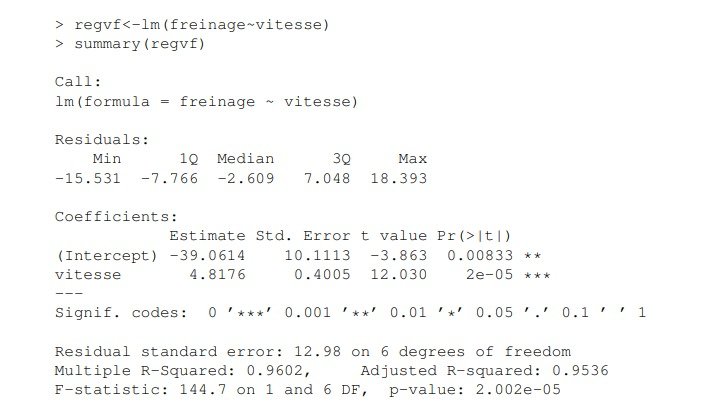
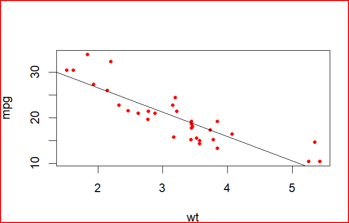
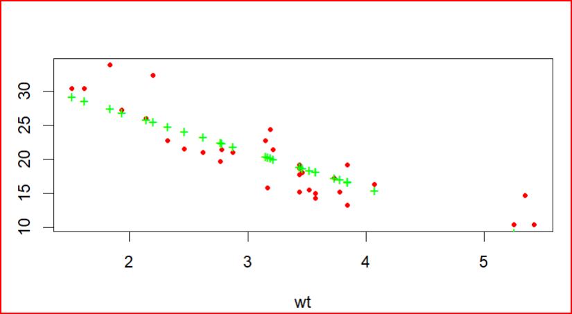
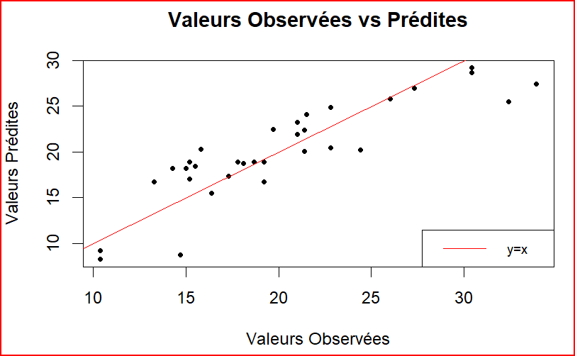

# cour : **Regression lineaire simple en R:**

## 1. **Introduction:**

>La régression linéaire simple est une technique qui vise à établir une relation linéaire entre une variable dépendante (la variable que l'on cherche à prédire) et une variable indépendante (la variable utilisée pour effectuer la prédiction). L'objectif principal est de créer une ligne (ou une droite) qui représente au mieux la relation entre ces deux variables.


- **Utilité de la Régression Linéaire Simple :**

    1. **Prédiction :** L'un des principaux objectifs de la régression linéaire simple est de faire des prédictions. En comprenant la relation linéaire entre deux variables, on peut estimer la valeur d'une variable en fonction de la valeur de l'autre. Par exemple, prédire les ventes en fonction des dépenses publicitaires.

    2. **Compréhension des Relations :** La régression linéaire permet de quantifier et de comprendre la relation entre les variables. Elle fournit des coefficients qui indiquent la force et la direction de l'impact de la variable indépendante sur la variable dépendante.


## 2. **Modele de regression :**

### 2.1 **la fonction ``lm()``:**

- **Description :**

    >La fonction `lm()` en R est utilisée pour ajuster des modèles de régression linéaire. Elle permet de créer un modèle basé sur la méthode des moindres carrés, qui vise à minimiser la somme des carrés des écarts entre les valeurs observées et les valeurs prédites par le modèle. 
    
    - La fonction `lm()` prend en entrée une formule décrivant la relation entre les variables et un jeu de données. Elle ajuste ensuite un modèle de régression linéaire basé sur ces données.

- **Syntaxe :**
 
    ```R
    lm(formula, data = nom_data)
    ```

    - `formula`: La formule spécifiant la relation entre les variables: Par exemple, `y ~ x` spécifie que `y` est la variable dépendante et `x` est la variable indépendante.

    - `data`: Le jeu de données dans lequel les variables de la formule sont à chercher.


- **Exemple :**

    ```R
    # on va travailler avec le data.frame : mtcras
    df <- mtcars
    head(df)
    # question : est ce que on peut expliquer la varibale mpg par wt ? 
    plot(mpg ~ wt , data = mtcars , pch=20)

    # le coefficent de corréclation : 
    cor(df$mpg , df$wt) # cor = -0.86 

    # modele de regression : 

    fit <- lm(mpg ~ wt , data = df)
    fit 
    # mpg.shp = 37.285 -5.344*wt

    ```

### 2.2 **``summary()`` applique sur Modele de Regression ``lm()``:** 

- **Description:**

    >La fonction `summary()` appliquée à un modèle de régression linéaire simple en R fournit un ensemble d'informations statistiques utiles sur le modèle ajusté tq : 

    - **Coefficients :** Les coefficients estimés pour l'intercept et la pente de la droite de régression.

    - **Erreurs standards :** Les erreurs standards associées aux coefficients.

    - **Valeurs t et p :** Les valeurs t et p associées à chaque coefficient, permettant de tester l'hypothèse nulle selon laquelle le coefficient est égal à zéro.

    - **Coefficient de détermination (R²) :** Mesure de la proportion de la variance de la variable dépendante expliquée par le modèle.

    - **F-statistic et p-value :** La statistique F et la valeur p associée, utiles pour tester la significativité globale du modèle.

    - **Résidus :** Des statistiques sur les résidus du modèle, tels que la moyenne des résidus et les quartiles.

    
- **Exemple 1:**

    Dans cet exemple, nous voulons expliquer la distance de freinage d'une voiture par sa vitesse. Ainsi, au début, nous réalisons un modèle de régression linéaire simple :

    ```R
    # Exemple : modèle de régression linéaire simple 
    regvf<-lm(freinage~vitesse)
    summary(regvf)

    ```

    


    * La colonne ``Estimate`` donne les  coefficients estimés pour chaque variable du modèle  (β₀ et β₁) = (-39.06,4.82).

    *  La colonne ``Pr(>|t|)`` donne les p-valeurs de tests de nullité du coefficient. Dans l’exemple, ces p-valeurs sont très faibles, donc les hypothèses ``β0 = 0`` et ``β1 = 0`` sont largement rejetées. (Dans les lignes correspondantes, plus il y a d’étoiles plus le rejet est fort).

    * La ``Residual standard error`` est la valeur $\hat{\sigma}$ .

    * Le ``Multiple R-Squared`` est la valeur de $R^2$ , ce qui permet de faire le test de pertinence de la régression . 

    * La ``F-statistic`` est la statistique de test de pertinence de la régression, On retrouve qu’elle vaut 144.7. La ``p-value`` fournie est la p-valeur de ce test. Elle est très faible
    $2.10^{-5}$ donc on conclut bien que la régression linéaire est pertinente sur notre exemple


- **Exemple 2:**

    ```R
    # on va travailler avec le data.frame : mtcras
    df <- mtcars
    head(df)
    # question : est ce que on peut expliquer la varibale mpg par wt ? 
    plot(mpg ~ wt , data = mtcars , pch=20)

    # le coefficent de corréclation : 
    cor(df$mpg , df$wt) # cor = -0.86 

    # modele de regression : 

    fit <- lm(mpg ~ wt , data = df)
    fit 
    # mpg.shp = 37.285 -5.344*wt
    summary(fit)
    ```


    ```output
    Call:
    lm(formula = mpg ~ wt, data = df)

    Residuals:
        Min      1Q  Median      3Q     Max 
    -4.5432 -2.3647 -0.1252  1.4096  6.8727 

    Coefficients:
                Estimate Std. Error t value Pr(>|t|)    
    (Intercept)  37.2851     1.8776  19.858  < 2e-16 ***
    wt           -5.3445     0.5591  -9.559 1.29e-10 ***
    ---
    Signif. codes:  0 ‘***’ 0.001 ‘**’ 0.01 ‘*’ 0.05 ‘.’ 0.1 ‘ ’ 1

    Residual standard error: 3.046 on 30 degrees of freedom
    Multiple R-squared:  0.7528,	Adjusted R-squared:  0.7446 
    F-statistic: 91.38 on 1 and 30 DF,  p-value: 1.294e-10

    ```

### 2.3  **Attributs du modèle  :**

- **Coefficients :**
   >Vous pouvez obtenir les coefficients estimés du modèle à l'aide de la fonction `coefficients()` ou `modele$coefficients` :

   ```R
   coefficients(modele)
   # ou
   modele$coefficients
   # ou 
   coef(fit)
   ```

- **Valeurs prédites :**
   >Les valeurs prédites par le modèle pour les observations dans le jeu de données peuvent être obtenues avec ``fitted.values()`` :

   ```R
   fitted.values(modele)
   ```

- **Résidus :**
   >Les résidus du modèle (différences entre les valeurs observées et les valeurs prédites) peuvent être obtenus avec  `residuals()` ou `resid()`:

   ```R
   residuals(modele_regression)
   ```

#### RQ : 

- On peut trouver l'ensemble des attributs liés à `lm` avec `names(modele)` ou `modele` le nom de l'objet lm . 


## 3. **Intervale de confiance:``confint()``**


- **Description :**
    
    >La fonction `confint()` en R est utilisée pour calculer les intervalles de confiance pour les coefficients d'un modèle statistique, comme un modèle de régression linéaire.
    


- **Syntaxe :**

    ```R
    confint(object, level = 0.95)
    ```

    - `object` : L'objet du modèle pour lequel vous souhaitez calculer les intervalles de confiance. Typiquement, cela serait un modèle de régression linéaire (`lm()`).

    - `level` : Niveau de confiance désiré pour l'intervalle de confiance. Par défaut, il est réglé à 0.95, ce qui signifie un intervalle de confiance de 95%.


- **Exemple :**

    ```R
    # Création du modèle de régression linéaire
    modele_regression <- lm(variable_dependante ~ variable_independante, data = donnees)

    # Calcul des intervalles de confiance pour les coefficients
    ic.95 <- confint(modele_regression ,)

    # Affichage des intervalles de confiance
    print(ic.95)
    ```

    Dans cet exemple, `ic.95` contiendra les intervalles de confiance pour les coefficients du modèle de régression linéaire spécifié. Ces intervalles sont utiles pour évaluer la précision des estimations des coefficients. Plus l'intervalle est étroit, plus l'estimation du coefficient est précise. En général, un intervalle de confiance de 95% est couramment utilisé, mais cela peut être ajusté en modifiant le paramètre `level` dans la fonction `confint()`.

- **Interprétation:**
 
    - **Plus l'intervalle est étroit :** Plus l'intervalle de confiance est étroit, plus l'estimation est précise. Cela peut indiquer une relation plus robuste dans les données.

    - **Si l'intervalle inclut zéro :** Si l'intervalle de confiance pour un coefficient de régression inclut zéro, cela suggère que ce coefficient n'est pas significativement différent de zéro. Cela peut indiquer que la variable correspondante n'a pas un effet significatif sur la variable dépendante.

    - **Si l'intervalle ne contient pas zéro :** Si l'intervalle ne contient pas zéro, cela suggère que le coefficient est significativement différent de zéro, ce qui peut indiquer une relation significative entre la variable indépendante et la variable dépendante.


## 4. **Visualisation :**

>La visualisation est un outil essentiel pour interpréter les résultats d'un modèle de régression linéaire simple. Les graphiques vous aident à comprendre la relation entre les variables et à évaluer la qualité de l'ajustement du modèle. 


### 4.1 **valeurs estimées vs valeurs observées :**

- **methode 1 :  nuage de points des données observées avec la droite de régression**

    ```R
    df <- mtcars
    
    # modele de regression : 
    fit <- lm(mpg ~ wt , data = df)
    
    # les nuages de poinst (wt_i et mpg_i) i 
    plot(mpg ~ wt , data = df , col="red" , pch = 20)

    # la droite de regression : mpg.shp = 37.285 -5.344*wt
    abline(fit)
    ```

    


- **methode 2 : nuage de points des données observées et estimées**

    ```R
    df <- mtcars
    
    # modele de regression : 
    fit <- lm(mpg ~ wt , data = df)
    
    # les nuages de poinst observées : 
    plot(mpg ~ wt , data = df , col="red" , pch = 20)

    # les nauges des points estimées : 
    points(df$wt , fitted.values(fit) , col="green" , pch="+")

    ```

    

- **methode 3 : valeurs estimées en fonction des valeurs observées**
   
   >On peut visualiser les valeurs prédites en fonction des valeurs observées, puis ajouter une ligne ``y = x`` pour comparer les valeurs observées et prédites.

    ```R
    # Création du graphique de dispersion
    plot(df$mpg, fitted.values(fit), main = "Valeurs Observées vs Prédites", 
        xlab = "Valeurs Observées", ylab = "Valeurs Prédites" , pch=20
    )
    # Ajout d'une ligne d'identité y = x
    abline(a = 0, b = 1, col = "red")

    # Légende
    legend("bottomright", legend = "y=x", col = "red", lty = 1, cex = 0.8)

    ```

    
    


### 4.2. **Graphique de résidus :**

- Affiche les résidus  en fonction de la variable indépendante.
- Aide à identifier des schémas ou des tendances dans les résidus.

```R
# Création du graphique de résidus
plot(variable_independante, resid(modele_regression), main = "Graphique de Résidus", ylab = "Résidus")
abline(h = 0, col = "red")
```

### 4.3 **Graphique QQ (Quantile-Quantile) des résidus :**

- Aide à évaluer si les résidus suivent une distribution normale.
- Un alignement avec une ligne droite indique une distribution normale.

```R
# Graphique QQ des résidus
qqnorm(resid(modele_regression))
qqline(resid(modele_regression), col = "red")
```


## 5. Verification des hypothése 


## 6. Predication avce ``predicat()``


