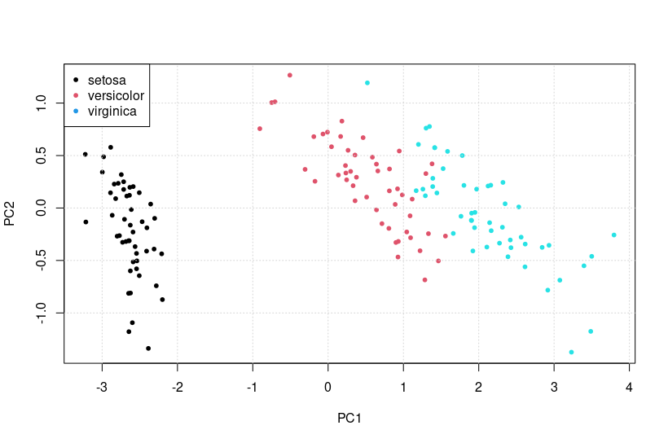
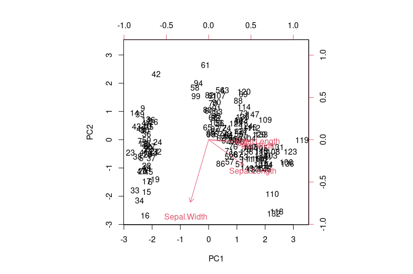

# cour 25 : **``ACP``**

>Ce cours n'aborde pas la partie théorique de l'ACP. Il est recommandé d'avoir un aperçu de la théorie de l'ACP.

## 1. **Introduction:**

- **ce qoui L'ACP ? :**

    >``ACP`` signifie Analyse en Composantes Principales. C'est une technique statistique utilisée en analyse de données multivariées pour **réduire la dimensionnalité** des données tout en préservant autant que possible leur structure et leurs informations essentielles. L'objectif principal de l'ACP est de transformer un ensemble de variables corrélées en un ensemble de variables non corrélées, appelées composantes principales. Ces composantes principales sont ordonnées en fonction de la quantité de variance qu'elles capturent dans les données d'origine.


- **Contexte:**

    - On a un tableau de données représenté par une matrice $X$  qui contient $p$ colonnes ( $x^j$ ) représentant les variables et $n$ lignes (  $x_i$  ) représentant les individus:

    - Chaque individu  $x_i$ du tableau $X$ est considéré comme un point d’un espace vectoriel $E$ = $R^p$ de dimension p.
    
    - L’ensemble des individus constitue un nuage de points dans E.

$$
X = \begin{bmatrix}
x_{1,1} & x_{1,2} & \cdots & x_{1,p} \\
x_{2,1} & x_{2,2} & \cdots & x_{2,p} \\
\vdots & \vdots & \ddots & \vdots \\
x_{n,1} & x_{n,2} & \cdots & x_{n,p}
\end{bmatrix}     
$$


- **objetcif :** 
    
    - On cherche à réduire le nombre p de variables en préservant au maximum la structure du nuage, afin de le représenter le plus fidèlement possible


- **Principe :** 
    
    - L’ACP vise à **``projeter``** les données dans un sous-espace approprié, de dimension plus faible, préservant la topologie du nuage.

    - La topologie du nuage est liée à la variabilité des données, c'est-à-dire la variance empirique de chaque colonne $s_j^2$. Ainsi, on cherche un espace dans lequel la projection du nuage conserve au maximum la variabilité précédente.


## 2. **les fonction `prcomp` && `princomp`:**


### 2.1. **la fonction `prcomp`:**


- **Description:**

    >La fonction `prcomp` est une fonction en R qui est utilisée pour effectuer une analyse en composantes principales (PCA). Lorsque vous appliquez la fonction `prcomp` à vos données, elle retourne un objet de classe ``prcomp`` contenant plusieurs composantes importantes. 

- **Syntaxe:**

    ```R
    prcomp(data, scale = FALSE, center = TRUE)
    ```

    - `data` : L'ensemble de données à analyser. Il peut s'agir d'un data frame ou d'une matrice numérique.
    - `scale` : Une valeur logique indiquant si les variables doivent être mises à l'échelle (réduites) avant l'analyse. Par défaut, `scale = FALSE`.
    - `center` : Une valeur logique indiquant si les variables doivent être centrées (soustraites de leur moyenne) avant l'analyse. Par défaut, `center = TRUE`.


- **Attributs d'un objet ``prcomp``:**

    - `sdev` : 
        
        - Les écarts-types des composantes principales , ce sont les racines carrées des valeurs propres de la matrice de covariance ou de corrélation des données.
        
        - Ces écarts-types représentent l'importance relative de chaque composante principale dans la variation totale des données. Les composantes principales avec des écarts-types plus élevés captent une plus grande proportion de la variabilité des données


    - `rotation` : La matrice de rotation  qui peut être utilisée pour transformer les données originales dans l'espace des composantes principales ( $U$ ).
    
    - `x` : Les données projetées sur l'espace des composantes principales (la matrice $C$).

- **summary() sur un objet ``prcomp``:**

    - Lorsque vous appelez la fonction `summary()` sur un objet résultant de `prcomp()` en R, vous obtenez un résumé des résultats de l'Analyse en Composantes Principales (ACP) effectuée. 
    
    
    - Voici les informations généralement fournies par la fonction `summary()` sur un tel objet :

        - **Standard Deviation (Écart-type) :** Les écarts-types des composantes principales, indiquant la quantité de variance expliquée par chaque composante.

        - **Proportion of Variance (Proportion de variance) :** La proportion de variance expliquée par chaque composante principale. Cette proportion est calculée en divisant la variance de chaque composante par la somme totale des variances de toutes les composantes.

        - **Cumulative Proportion (Proportion cumulative) :** La proportion cumulative de variance expliquée par les composantes principales jusqu'à la composante correspondante. Cela indique la proportion totale de variance expliquée par les composantes principales jusqu'à un certain point.

    - Voici un exemple de résultat de `summary()` sur un objet `prcomp` :

        ```
        > summary(acp)
        Importance of components:
                                PC1    PC2     PC3     PC4
        Standard deviation     2.0267 0.3235 0.02021 0.00923
        Proportion of Variance 0.9246 0.0530 0.00212 0.00012
        Cumulative Proportion  0.9246 0.9776 0.97975 0.97988
        ```

- **Exemple:**

    ```R
    # Charger les données
    data(iris)

    # Effectuer une ACP
    acp <- prcomp(iris[, -5], scale = TRUE)

    # Afficher les composantes principales
    summary(acp)
    ```

    Dans cet exemple, nous avons effectué une ACP sur l'ensemble de données Iris en utilisant toutes les variables sauf la variable de classe (dernière colonne). Nous avons spécifié `scale = TRUE` pour mettre à l'échelle les variables. Ensuite, nous avons affiché un résumé des résultats de l'ACP en utilisant la fonction `summary()`.


### 2.2 **la fonction `princomp`:**

- **Description:**

    >La fonction `princomp()` effectue une ACP sur un ensemble de données en utilisant la décomposition en valeurs propres de la matrice de covariance. Elle calcule les composantes principales ainsi que d'autres statistiques utiles.

- **Syntaxe:**

    ```R
    princomp(data, cor = FALSE, scores = TRUE)
    ```

    - `data` : L'ensemble de données à analyser. Il peut s'agir d'un data frame ou d'une matrice numérique.
    - `cor` : Une valeur logique indiquant si les variables doivent être corrélées avant l'analyse. Par défaut, `cor = FALSE`.
    - `scores` : Une valeur logique indiquant si les scores des composantes principales doivent être calculés et retournés. Par défaut, `scores = TRUE`.


- **Attributs d'un objet ``princomp``:**

    - `sdev` : Les écarts-types des composantes principales.
    - `loadings` : La matrice des charges factorielles (ou de rotation $U$ ), qui peut être utilisée pour interpréter les composantes principales.
    - `scores` : Les scores des composantes principales.


- **summary() sur un objet ``prcomp``:**

    - Lorsque vous appelez la fonction `summary()` sur un objet résultant de `princomp()` en R, vous obtenez un résumé des résultats de l'Analyse en Composantes Principales (ACP) effectuée. 
    
    - Voici les informations généralement fournies par la fonction `summary()` sur un tel objet :

        - **Standard Deviation (Écart-type) :** Les écarts-types des composantes principales, indiquant la quantité de variance expliquée par chaque composante.

        - **Proportion of Variance (Proportion de variance) :** La proportion de variance expliquée par chaque composante principale. Cette proportion est calculée en divisant la variance de chaque composante par la somme totale des variances de toutes les composantes.

        - **Cumulative Proportion (Proportion cumulative) :** La proportion cumulative de variance expliquée par les composantes principales jusqu'à la composante correspondante. Cela indique la proportion totale de variance expliquée par les composantes principales jusqu'à un certain point.


    - Voici un exemple de résultat de `summary()` sur un objet `princomp` :

        ```
        > summary(acp)
        Importance of components:
                                Comp.1     Comp.2     Comp.3     Comp.4
        Standard deviation     0.8649707 0.08326653 0.02615773 0.01489646
        Proportion of Variance 0.9246187 0.05306648 0.01710261 0.00521219
        Cumulative Proportion  0.9246187 0.97768522 0.99478782 1.00000000
        ```


- **Exemple:**

    ```R
    # Charger les données
    data(iris)

    # Effectuer une ACP
    acp <- princomp(iris[, -5], cor = TRUE)

    # Afficher les composantes principales
    summary(acp)
    ```


### 2.3 **la fonction ``scale()``:**

- **Description:**
    
    >La fonction `scale()` en R est utilisée pour centrer et/ou réduire les variables d'un ensemble de données. Elle est souvent utilisée avant d'appliquer des analyses statistiques, telles que l'Analyse en Composantes Principales (ACP), la régression linéaire, etc., pour mettre les variables sur une même échelle et éviter que certaines variables ne dominent les autres en raison de leurs échelles différentes.


- **Syntaxe:**

    ```R
    scaled_data <- scale(data, center = TRUE, scale = TRUE)
    ```

    - `data` : L'ensemble de données à centrer et/ou à réduire. Il peut s'agir d'une matrice ou d'un data frame.
    - `center` : Une valeur logique indiquant si les variables doivent être centrées (soustraites de leur moyenne). Par défaut, `center = TRUE`.
    - `scale` : Une valeur logique indiquant si les variables doivent être mises à l'échelle (divisées par leur écart type). Par défaut, `scale = TRUE`.


- **Exemple :**

    ```R
    # Charger les données
    data(iris)

    # Sélectionner les variables à centrer et réduire
    selected_data <- iris[, -5]

    # Centrer et réduire les variables
    scaled_data <- scale(selected_data)

    # Afficher les premières lignes des données centrer et réduites
    head(scaled_data)
    ```


#### RQ  **`prcomp()` vs `princomp()`:**


- La principale différence entre les fonctions `prcomp()` et `princomp()` en R réside dans la méthode utilisée pour effectuer l'Analyse en Composantes Principales (ACP) :

    - **prcomp() :**
        - Utilise la décomposition en valeurs singulières (SVD) pour calculer les composantes principales.
        - Cette méthode est plus efficace numériquement et plus stable pour les matrices de données de grande taille.

    - **princomp() :**
        - Utilise la décomposition en valeurs propres de la matrice de covariance pour calculer les composantes principales.
        - Cette méthode est plus traditionnelle et plus couramment utilisée dans la littérature statistique.


## 3. **Visualisation :**


### 3.1 **Visualiser les valeurs propres des composantes principales:**


- **Description:**

    - Lorsque vous appelez la fonction `plot()` sur un objet résultant de `prcomp()` en R, vous obtenez un graphique représentant les résultats de l'Analyse en Composantes Principales (ACP).

   - Ce graphique montre les valeurs propres des composantes principales , ce qui permet d'évaluer l'importance de chaque composante dans la représentation des données.


- **Syntaxe:**

    ```R
    # modele ACP 
    acp <- prcomp(data)

    # plot sur un objet prcomp
    plot(acp)
    ```


- **Voici un exemple d'utilisation de la fonction `plot()` sur un objet `prcomp` :**

    ```R
    # Charger les données
    data(iris)

    # Effectuer une ACP
    acp <- prcomp(iris[, -5], scale = TRUE)

    # Graphique des valeurs propres
    plot(acp)

    ```

    


### 4.2 **Visualiser la projection du nuage de points :**


- **Syntaxe:**

    ```R
    plot(modele$x[, 1:2], col = 1 + 1 * (data$class == "type2"), pch = 20, ...)
    ```

    Dans cette syntaxe :

    - `plot()` utilisée pour créer des graphiques.
    
    - `modele$x[, 1:2]` représente les coordonnées des points projetés sur les deux premières composantes principales du modèle.
    
    - `col = 1 + 1 * (data$class == "type2")` : 
        - détermine la couleur des points en fonction de la classe des données. Si la classe est "type2", la couleur est définie comme 2 ; sinon, elle est définie comme 1.
    
    - `pch = 20` spécifie le type de point utilisé dans le graphique. Dans ce cas, le point est représenté par un cercle plein.
    
    - `...` représente d'autres arguments que vous pouvez ajouter selon vos besoins, tels que les titres, les axes, etc.

- **Exemple:**

    ```R

    # visualisation de la projetcion du nugaes de points :

    df <- iris

    head(df)

    names <- unique(iris$Species)
    names

    acp <- prcomp(df[, - 5])

    # projection sur PC1 , PC2
    plot(acp$x[, 1:2] , col = 1+ 1*(df$Species == names[2]) + 100*(df$Species == names[3]) , pch = 20   )
    grid()
    legend("topleft", legend = names  , col = c(1, 2 ,100) , pch = 20)

    ```

    


### 4.3 **Avec ``biplot()``:**

- **Description:**

    >La fonction `biplot()` en R est utilisée pour créer un biplot, qui est un type de graphique utilisé en Analyse en Composantes Principales (ACP) pour visualiser à la fois les observations et les variables dans le même graphique, projetés sur les composantes principales.


- **Syntaxe :**

    ```R
    biplot(object, choices = c(1, 2), scale = 1, pc.biplot = FALSE, ...)
    ```

    - `object` : L'objet résultant de `prcomp()` ou `princomp()` contenant les résultats de l'ACP.
    - `choices` : Un vecteur indiquant les composantes principales à utiliser pour créer le biplot. Par défaut, les deux premières composantes principales sont utilisées.
    - `scale` : Une valeur numérique spécifiant l'échelle des flèches représentant les variables sur le biplot. Par défaut, `scale = 1`.
    - `pc.biplot` : Une valeur logique indiquant si les flèches représentant les variables doivent être parallèles aux axes des composantes principales. Par défaut, `pc.biplot = FALSE`.
    - `...` : D'autres arguments graphiques à passer à la fonction `plot()` pour personnaliser le biplot.

- **Exemple :**

    ```R
    # Charger les données
    data(iris)

    # Effectuer une ACP
    acp <- prcomp(iris[, -5], scale = TRUE)

    # Créer un biplot
    biplot(acp, scale = 0)
    ```

    Dans cet exemple, nous avons utilisé la fonction `biplot()` sur un objet `prcomp` contenant les résultats de l'ACP sur l'ensemble de données Iris. Nous avons spécifié `scale = 0` pour désactiver le redimensionnement automatique des flèches représentant les variables sur le biplot.


    

## 4. **le package ``FactoMineR``:**


## RQ : 


