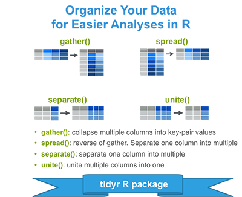
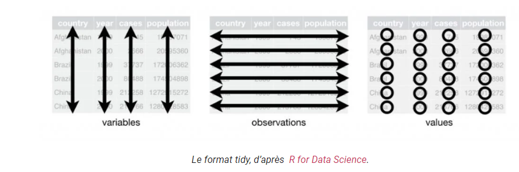

# cour : **Cleaning-data : ``tidyr``**


## 1. **Introduction:**


### 1.1 **Concept ``data-clean``:**

- **Definition:**

    >Le concept du nettoyage des données, également connu sous le terme anglais de "data cleaning" , fait référence au processus de préparation et de transformation des données pour les rendre appropriées à l'analyse. Le nettoyage des données est une étape essentielle dans le processus d'analyse des données, car il vise à garantir que les données sont fiables, cohérentes, précises et prêtes à être utilisées pour prendre des décisions ou tirer des conclusions.

- **étapes:**

    - **Détection et correction des erreurs** : Cela inclut l'identification et la correction des erreurs de saisie, des valeurs aberrantes, des données manquantes, des doublons et d'autres incohérences dans les données.

    - **Normalisation et standardisation** : Il s'agit d'assurer une cohérence dans la manière dont les données sont enregistrées et représentées. Par exemple, la conversion des formats de dates ou des unités de mesure pour les rendre cohérents dans l'ensemble du jeu de données.

    - **Gestion des valeurs manquantes** : Cela implique de décider comment traiter les valeurs manquantes, telles que les supprimer, les remplacer par une valeur par défaut ou les imputer à partir des valeurs existantes.

    - **Validation des données** : Cela implique de vérifier que les données sont valides par rapport aux critères prédéfinis, tels que les plages de valeurs autorisées ou les contraintes de format.

    - **Consolidation et transformation** : Il peut être nécessaire de regrouper, fusionner ou transformer les données pour les rendre plus cohérentes ou plus faciles à analyser.


### 1.2 **package ``tidyr``:**


- **Introduction à tidyr** :
    
    >Le package tidyr est un ensemble d'outils conçus pour travailler avec des données "tidy", c'est-à-dire des données organisées de manière cohérente avec chaque variable formant une colonne et chaque observation formant une ligne. L'objectif principal de tidyr est de transformer des données en un format "tidy" pour faciliter l'analyse, la visualisation et le partage des résultats.


- **Fonctionnalités principales de tidyr** :

    - **Réorganisation des données** : Tidyr fournit des fonctions telles que `pivot_longer()` et `pivot_wider()` pour réorganiser les données entre les formats "long" et "large".

    - **Gestion des valeurs manquantes** : Tidyr offre des outils pour gérer les valeurs manquantes à l'aide de fonctions telles que `drop_na()` et `replace_na()`.

    - **Séparation et fusion des colonnes** : Tidyr permet de séparer une colonne en plusieurs colonnes à l'aide de `separate()` et de fusionner plusieurs colonnes en une seule avec `unite()`.

    - **Nettoyage des noms de colonnes** : Vous pouvez nettoyer et renommer les noms de colonnes avec des fonctions telles que `rename_with()` et `clean_names()`.





### 1.3 **les formats ``tidy`` ,  ``long`` et ``large``:**


- **format ``tidy``:**

    > format ``tidy``:  une ligne par observation, une variable par colonne, et une valeur au croisement d’une ligne et d’une colonne.

    - il existe deux grands type de format ``tidy``, le format ``wide`` et le fomat ``long``.

    


- **Format ``Long``** :

    - le format long est structuré de manière à ce que chaque observation soit représentée par une ligne unique dans le tableau.
    - Les variables sont  stockées dans une colonne appelée ``variable``, tandis que les valeurs correspondantes sont stockées dans une autre colonne appelée ``value``.
    - Ce format est souvent recommandé pour faciliter la manipulation, l'analyse et la visualisation des données, notamment avec des outils comme ggplot2.

    Exemple de format long :
    ```
        Personne   Variable   Valeur
    1    Alice     Taille     170
    2    Alice     Poids      65
    3    Bob       Taille     165
    4    Bob       Poids      70
    ```


- **Format ``Large`` (``Wide``)** :

    - Le format large est structuré de manière à ce que chaque variable soit stockée dans une colonne distincte du tableau.
    - Chaque observation est toujours représentée par une ligne unique, mais les différentes mesures ou variables sont réparties sur plusieurs colonnes.
    - Ce format peut être plus facile à lire pour les humains et est souvent utilisé dans des présentations ou des rapports où une largeur de tableau plus importante est acceptable.

    Exemple de format large :
    ```
        Personne   Taille   Poids
    1    Alice      170      65
    2    Bob        165      70
    ```


## 2. **les fonctions ``gather()`` && ``spread()`` :**


### 2.1 **la fonction ``gather()``:**

- **Description** :

    >La fonction `gather()` dans le package tidyr est utilisée pour transformer les données d'un format ``large``  à un format ``long``, en regroupant plusieurs colonnes en une seule colonne, tout en conservant les valeurs correspondantes dans une autre colonne.


- **Syntaxe** :

    ```R
    gather(data, key, value, ..., na.rm = FALSE, convert = FALSE)
    ```
    - `data` : Le dataframe à transformer.
    - `key` : Le nom de la nouvelle colonne qui contiendra les noms des variables regroupées.
    - `value` : Le nom de la nouvelle colonne qui contiendra les valeurs correspondantes.
    - `...` : Les colonnes à regrouper dans la colonne `key`.
    - `na.rm` : Une valeur logique indiquant si les valeurs manquantes doivent être supprimées. Par défaut, `na.rm = FALSE`.
    - `convert` : Une valeur logique indiquant si les variables doivent être converties en type de données le plus approprié. Par défaut, `convert = FALSE`.

- **Exemple** :

    Supposons que nous avons un dataframe `students` avec les colonnes `Name`, `Math_score`, `Science_score` et `English_score`, et nous voulons regrouper les scores de toutes les matières dans une seule colonne.

    ```R
    # Exemple de données
    students <- data.frame(
        Name = c("Alice", "Bob", "Charlie"),
        Math_score = c(85, 72, 90),
        Science_score = c(78, 80, 85),
        English_score = c(82, 75, 88)
    )

    # Utiliser gather pour regrouper les scores de toutes les matières
    students_long <- gather(students, key = "Subject", value = "Score", Math_score ,Science_score , English_score )

    # Afficher le dataframe avec les données réorganisées
    print(students_long)
    ```

    Résultat :
    ```
        Name       Subject Score
    1  Alice    Math_score    85
    2    Bob    Math_score    72
    3 Charlie    Math_score    90
    4  Alice Science_score    78
    5    Bob Science_score    80
    6 Charlie Science_score    85
    7  Alice English_score    82
    8    Bob English_score    75
    9 Charlie English_score    88
    ```


### 2.2 **la fonction ``spread()``:**

- **Description** :
    >La fonction `spread()` dans le package tidyr est utilisée pour transformer les données d'un format ``long``  à un format ``large`` , en éclatant une colonne contenant des valeurs uniques en plusieurs colonnes, avec une colonne pour chaque valeur unique.


- **Syntaxe** :
    ```R
    spread(data, key, value, fill = NULL, convert = FALSE)
    ```
    - `data` : Le dataframe à transformer.
    - `key` : Le nom de la colonne à éclater en plusieurs colonnes.
    - `value` : Le nom de la colonne qui contient les valeurs correspondantes à éclater.
    - `fill` : Une valeur par défaut pour remplir les valeurs manquantes. Par défaut, `fill = NULL`.
    - `convert` : Une valeur logique indiquant si les variables doivent être converties en type de données le plus approprié. Par défaut, `convert = FALSE`.


- **Exemple** :

    Supposons que nous avons un dataframe `students` avec les colonnes `Name`, `Subject` et `Score`, où chaque étudiant a plusieurs entrées pour différentes matières, et nous voulons éclater les matières en plusieurs colonnes avec les scores correspondants.

    ```R
    # Exemple de données
    students <- data.frame(
        Name = c("Alice", "Alice", "Bob", "Bob", "Charlie", "Charlie"),
        Subject = c("Math", "Science", "Math", "Science", "Math", "Science"),
        Score = c(85, 78, 72, 80, 90, 85)
    )

    # Utiliser spread pour éclater les matières en plusieurs colonnes
    students_wide <- spread(students, key = Subject, value = Score)

    # Afficher le dataframe avec les données réorganisées
    print(students_wide)
    ```

    Résultat :
    ```
        Name Math Science
    1  Alice   85      78
    2    Bob   72      80
    3 Charlie   90      85
    ```


## 3. **les fonctions ``separate()`` && ``unite()``:**


### 3.1 **la fonction ``separate()``:**


- **Description** :

    >La fonction `separate()` dans le package tidyr est utilisée pour séparer une colonne contenant des valeurs combinées en plusieurs colonnes distinctes, en fonction de délimiteurs spécifiés ou de positions de caractères.


- **Syntaxe** :

    ```R
    separate(data, col, into, sep = "")
    ```
    - `data` : Le dataframe à modifier.
    - `col` : Le nom de la colonne à séparer.
    - `into` : Les noms des nouvelles colonnes créées.
    - `sep` : Le séparateur à utiliser pour diviser la colonne.


- **Exemple** :

    Supposons que nous avons un dataframe `students` avec une colonne `Name_Age` contenant des noms et des âges combinés, et nous voulons séparer cette colonne en deux colonnes distinctes : `Name` pour les noms et `Age` pour les âges.

    ```R
    # Exemple de données
    students <- data.frame(
    Name_Age = c("Alice_20", "Bob_22", "Charlie_25")
    )

    # Utiliser separate pour séparer la colonne Name_Age en deux colonnes distinctes
    students_separated <- separate(students, col = Name_Age, into = c("Name", "Age"), sep = "_")

    # Afficher le dataframe avec les données séparées
    print(students_separated)
    ```

    Résultat :
    ```
        Name Age
    1   Alice  20
    2     Bob  22
    3 Charlie  25
    ```


### 3.2 **la fonction ``unite()``:**

- **Description** :

    >La fonction `unite()` dans le package tidyr est utilisée pour fusionner plusieurs colonnes en une seule colonne, en combinant les valeurs de ces colonnes avec un séparateur spécifié.


- **Syntaxe** :

    ```R
    unite(data, col, ..., sep = "_")
    ```
    - `data` : Le dataframe à modifier.
    - `col` : Le nom de la nouvelle colonne résultante.
    - `...` : Les colonnes à fusionner.
    - `sep` : Le séparateur à utiliser entre les valeurs combinées. Par défaut, `sep = "_"`.


- **Exemple** :

    Supposons que nous avons un dataframe `students` avec des colonnes `First_Name` et `Last_Name`, et nous voulons les fusionner en une seule colonne `Full_Name`.

    ```R
    # Exemple de données
    students <- data.frame(
        First_Name = c("Alice", "Bob", "Charlie"),
        Last_Name = c("Smith", "Johnson", "Brown")
    )

    # Utiliser unite pour fusionner les colonnes First_Name et Last_Name en une seule colonne Full_Name
    students_combined <- unite(students, col = Full_Name, First_Name, Last_Name, sep = " ")

    # Afficher le dataframe avec les données fusionnées
    print(students_combined)
    ```

    Résultat :
    ```
    Full_Name
    1 Alice Smith
    2   Bob Johnson
    3 Charlie Brown
    ```


## 4. **les fonctions `drop_na()` et `replace_na()`:**


### 4.1 **la fonction  `drop_na()`:**

- **Description** :
    >La fonction `drop_na()` dans le package tidyr est utilisée pour supprimer les lignes d'un dataframe contenant des valeurs manquantes ``NA`` dans les colonnes spécifiées.


- **Syntaxe** :

    ```R
    drop_na(data, ..., .na.rm = FALSE)
    ```
    - `data` : Le dataframe à nettoyer.
    - `...` : Les colonnes spécifiées dans lesquelles les valeurs manquantes seront recherchées. Si aucune colonne n'est spécifiée, toutes les colonnes seront vérifiées.
    - `.na.rm` : Une valeur logique indiquant si les valeurs manquantes autres que NA (comme NaN ou NULL) doivent également être supprimées. Par défaut, `.na.rm = FALSE`.


- **Exemple** :

    Supposons que nous avons un dataframe `students` avec des valeurs manquantes dans certaines colonnes, et nous voulons supprimer les lignes contenant des valeurs manquantes dans la colonne `Age`.

    ```R
    # Exemple de données
    students <- data.frame(
    Name = c("Alice", "Bob", "Charlie", NA),
    Age = c(20, NA, 25, NA),
    Grade = c("A", "B", NA, "C")
    )

    # Utiliser drop_na pour supprimer les lignes contenant des valeurs manquantes dans la colonne Age
    students_clean <- drop_na(students, Age)

    # Afficher le dataframe nettoyé
    print(students_clean)
    ```

    Résultat :
    ```
        Name Age Grade
    1  Alice  20     A
    3 Charlie  25  <NA>
    ```


### 4.2 **la fonction  `replace_na()`:**


- **Description** :

    >La fonction `replace_na()` dans le package tidyr est utilisée pour remplacer les valeurs manquantes (``NA``) par une valeur spécifiée dans les colonnes spécifiées d'un dataframe.


- **Syntaxe** :

    ```R
    replace_na(data, replace, ..., .na.rm = FALSE)
    ```
    - `data` : Le dataframe à nettoyer.
    - `replace` : La valeur à utiliser pour remplacer les valeurs manquantes.
    - `...` : Les colonnes spécifiées dans lesquelles les valeurs manquantes seront remplacées. Si aucune colonne n'est spécifiée, toutes les colonnes seront traitées.
    - `.na.rm` : Une valeur logique indiquant si les valeurs manquantes autres que NA (comme NaN ou NULL) doivent également être remplacées. Par défaut, `.na.rm = FALSE`.

- **Exemple** :

    Supposons que nous avons un dataframe `students` avec des valeurs manquantes dans certaines colonnes, et nous voulons remplacer ces valeurs manquantes par une valeur par défaut, par exemple `"N/A"`.

    ```R
    # Exemple de données
    students <- data.frame(
        Name = c("Alice", "Bob", "Charlie", NA),
        Age = c(20, NA, 25, 22),
        Grade = c("A", "B", NA, "C")
    )

    # Utiliser replace_na pour remplacer les valeurs manquantes par "N/A" dans toutes les colonnes
    students_filled <- replace_na(students, "N/A")

    # Afficher le dataframe avec les valeurs manquantes remplacées
    print(students_filled)
    ```

    Résultat :
    ```
        Name Age Grade
    1  Alice  20     A
    2    Bob N/A     B
    3 Charlie  25   N/A
    4    N/A  22     C
    ```

